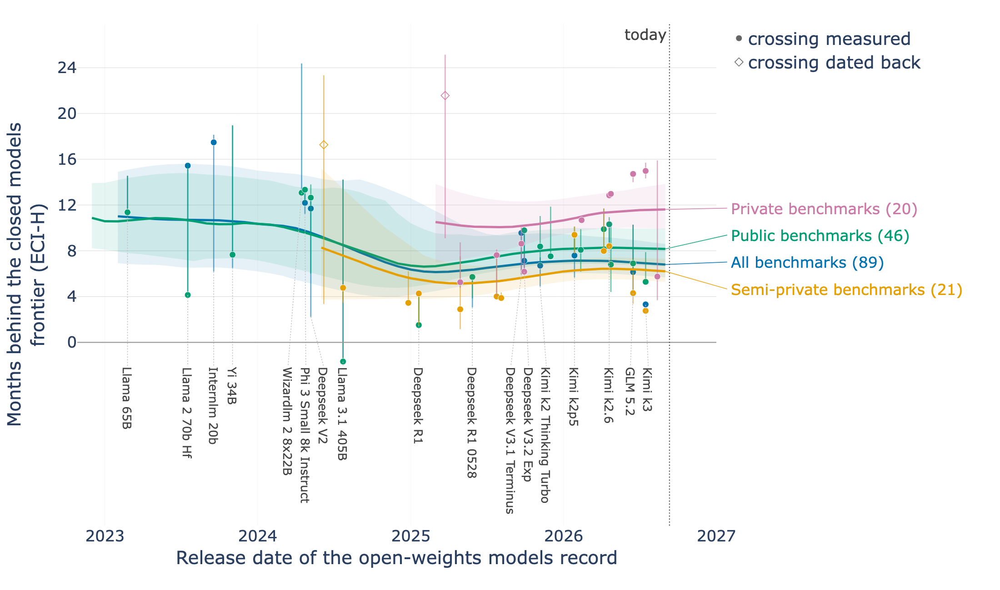
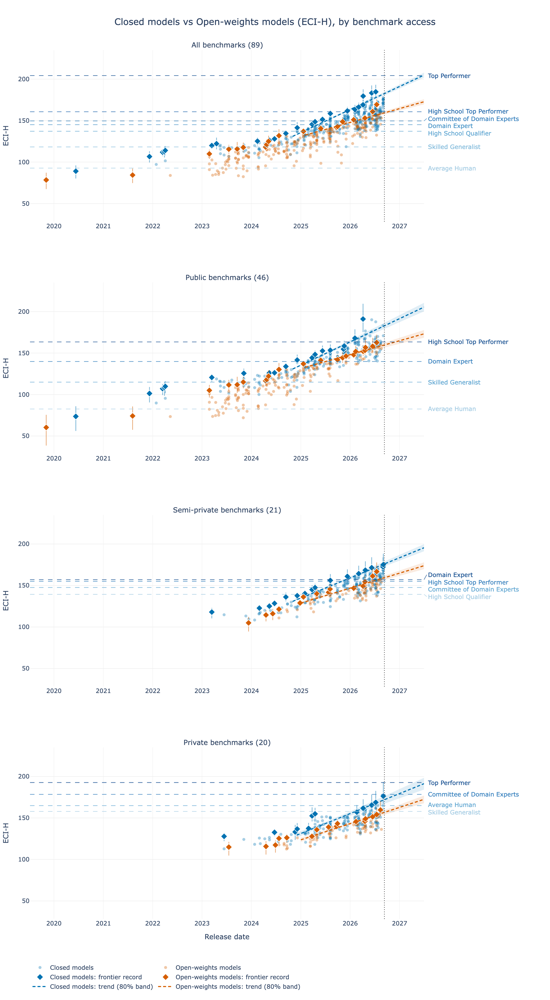

# How far behind the closed frontier are open-weights models? ECI-H by benchmark access

The question of [Ihle (2026), *How far behind are open models?*](https://www.lesswrong.com/posts/rJcCrXyEsJKmmDpWG/how-far-behind-are-open-models), asked on our ECI-H scale instead of per-benchmark score thresholds: how many months does the frontier of open-weights models trail the frontier of closed models, and does the answer change with the access class of the benchmarks (public, semi-private, private)? The US-vs-China cut this folder used to hold (as `us_cn_frontier`) is still available (`GROUP=country ./make_plots.sh`), but it is no longer the question.

Data generation 2026-09-08 (pipeline commit `cdb36cd`), today pinned at 2026-09-11. Figures and tables in this folder are copies of `5_outputs/data20260908/comparisons/frontier_gap_openness_*`.



## Method

**One fit per access scope.** The canonical K=1 ECI-H index (`3_fit/fit.py --preset canonical`, 8 x 10,000 draws) on all 89 benchmarks, and three quick fits (4 x 2,000 draws, 2,000 tuning) each restricted to one access class of `0_input/benchmarks.csv` (`--access public|semi_private|private`: 46, 21 and 20 benchmarks of the canonical scope; the two `open_problems` benchmarks join no class). Every fit is pinned to the same two anchors (Claude 3.5 Sonnet Oct 2024 = 130, GPT-5 medium = 150), so a model's ECI-H on public benchmarks and on private benchmarks read on one scale. The list of benchmarks per class: [`frontier_gap_openness_benchmark_classes.md`](frontier_gap_openness_benchmark_classes.md).

**Open or closed.** `1_curated/model_openness.csv`, built by `1_curated/3_build_model_openness.py`: `open` when the weights can be downloaded (Epoch's three "Open weights" classes, whatever the licence), `closed` when the model is reachable through an API or a product only, or was never released. The state at release counts (grok-2 is closed: its weights came out a year later). Sources in order: Epoch's `accessibility` metadata, the release family (a reasoning effort inherits its base release's state), then `model_openness_overrides.csv`, hand-researched for the 87 models Epoch does not cover or lists without an accessibility.

**Candidates and records.** The repository's candidate rule (`analysis.timelines.candidate_mask`: dated, not a human tier, evaluated on the axis) plus the K=1 reading of its coverage threshold: at least two scores in the scope, since one benchmark alone is not a full unit of evidence (`--min-obs 2`). No posterior-SD cap, no SOTA exemption, no cut in time. Records and trend points are read on one effort per family, the best on the axis, and one release per organization and day (`analysis.regimes.family_best`, `one_per_org_day`, the trend panels' rule); a record must also be the best release of its day, whatever the organization, so LLaMA 65B is the record of 24 February 2023 and its smaller siblings are not. The clouds keep every effort. A group's frontier is the running maximum of posterior-median ECI-H over those releases by date.

**Three readings of the gap** (`analysis.frontier_gap`, run by `4_diagnostics/1_frontier_gap.py`, one scope per run; `2_plot_frontier_gap.py` puts the scopes side by side):

1. *Months behind, per open record* (the figure above; Ihle's "backward-looking" gap). For every open record, the months between its release and the release of the first closed model to have beaten it. Per posterior draw: the earliest closed candidate, record or not, whose ECI-H draw is at or above the record's draw, so the lag carries the abilities' uncertainty (negative when the record led). Which closed model that is varies with the draw, and the records CSV names the most frequent ones with their share of draws (`first_leader_above`): DeepSeek V3 0324 on private benchmarks, GPT-4 0613's equal with two private scores, was beaten by GPT-4 0613 in June 2023 in 53% of draws and by Claude 3.5 Sonnet in June 2024 in 30%, hence 22 [9, 26] months. The closed frontier before its first measurement in a scope is unobserved, and the closed models that would have carried it were never scored there (on private benchmarks the field starts in June 2023 with GPT-3.5 Turbo and GPT-4 0613, while GPT-4 0314 and its predecessors have no private score). A level the first-day closed models already exceeded is therefore *backcast*: dated back from that day at the rate the closed frontier grew over its first 18 months of observation in that draw, the convention of the envelope forecast for a tier passed before its window. It is an estimate under a stated assumption, drawn as a hollow diamond, and the fraction of backcast draws is reported per record. A record that needs the assumption in more than two thirds of its draws is not a measured crossing at all — its lag would read the assumed early rate rather than anything observed — so it is left out of the series entirely (`analysis.frontier_gap.MAX_DATED_BACK_FRAC`, user decision 2026-09-11): 2 of the 19 open records on all benchmarks, 1 of 22 on public, 2 of 14 on semi-private and 5 of 16 on private. What survives with a visible share of backcast draws is drawn hollow (qwen2-72B-Instruct on semi-private benchmarks, 66% of draws; DeepSeek V3 0324 on private, 53%). Where the early rate is not positive nothing can be dated back and the lag is a lower bound (hollow triangle, none in the current data). A record no closed model has beaten has no lag. The curves are Gaussian-kernel smooths (6-month bandwidth) of the per-draw lags, with their 80% band across draws, drawn only where the records give the kernel at least one and a half points of weight.
2. *Trend lines.* One straight line per group through the posterior medians of its frontier points released since 2024-10-01 (running top-2, each point weighted by its posterior SD, the fit of the trend panels: `analysis.regimes.weighted_line_fit`), giving the slopes, the gap in ECI-H points today and the lag it implies (gap over the open slope). No two-regime split here: every frontier point since October 2024 is a reasoning-era release.
3. *Human tiers.* When each group's line reaches every tier that keeps a baseline in the scope (`frontier_gap_openness_<scope>_crossovers.csv` under the data generation's `comparisons/`; not copied here).

## Results

Median [80% interval]. The Δ columns are the difference against the all-benchmarks scope, drawn from the two independent posteriors.

| quantity | unit | All benchmarks | Public benchmarks | Δ public - all | Semi-private benchmarks | Δ semi-private - all | Private benchmarks | Δ private - all |
|---|---|---|---|---|---|---|---|---|
| Closed models frontier slope | ECI-H / yr | +27.7 [+26.5, +29.0] | +28.0 [+26.0, +30.1] | +0.3 [-2.0, +2.7] | +24.3 [+22.6, +26.0] | -3.5 [-5.5, -1.4] | +24.0 [+20.6, +27.5] | -3.6 [-7.3, -0.2] |
| Open-weights models frontier slope | ECI-H / yr | +16.7 [+15.1, +18.2] | +16.7 [+14.3, +19.1] | +0.1 [-2.8, +2.9] | +18.1 [+15.9, +20.2] | +1.4 [-1.3, +4.0] | +19.5 [+16.8, +22.2] | +2.9 [-0.3, +6.0] |
| Slope difference (Closed models - Open-weights models) | ECI-H / yr | +11.1 [+9.1, +13.1] | +11.3 [+8.2, +14.4] | +0.2 [-3.4, +4.0] | +6.2 [+3.6, +8.9] | -4.8 [-8.2, -1.5] | +4.6 [+0.1, +9.0] | -6.6 [-11.3, -1.9] |
| Gap today (Closed models - Open-weights models trend lines) | ECI-H | +23.2 [+20.5, +26.0] | +23.1 [+18.7, +27.8] | -0.1 [-5.3, +5.4] | +16.7 [+12.9, +20.5] | -6.5 [-11.3, -2.0] | +15.3 [+10.0, +20.5] | -8.0 [-13.6, -2.1] |
| Lag today (gap / Open-weights models slope) | months | 16.7 [13.7, 20.3] | 16.6 [12.2, 22.3] | -0.1 [-5.6, +6.3] | 11.0 [8.0, 14.9] | -5.6 [-10.4, -0.9] | 9.5 [5.7, 13.9] | -7.3 [-12.3, -2.1] |
| Lag of the latest Open-weights models record | months | 3.3 [3.3, 5.3] | 5.3 [4.8, 11.3] | +2.0 [+0.0, +8.0] | 2.8 [1.2, 4.4] | -0.6 [-2.5, +1.1] | 5.3 [2.1, 16.6] | +1.1 [-1.6, +13.3] |
| Mean lag of the last 12 months' Open-weights models records | months | 7.2 [6.1, 9.5] | 8.3 [6.9, 10.2] | +1.0 [-1.7, +3.3] | 6.2 [5.3, 7.3] | -1.0 [-3.5, +0.5] | 10.9 [9.5, 12.6] | +3.6 [+0.9, +5.7] |



What the numbers say:

- **Two readings, two magnitudes.** By the trend lines the open frontier is 15 to 24 ECI-H points below the closed one today, which the open slope converts into 18 [15, 22] months on all benchmarks, 16 on public, 11 on semi-private and 9 on private. Record by record, the open records of the last twelve months trail by 7.2 [6.1, 9.5] months on all benchmarks, 8.3 on public, 6.2 on semi-private and 10.9 [9.5, 12.6] on private. The lines read the whole 2024-2026 trend of the top-2 releases, the records only the level of the latest few: Kimi K3 (July 2026) sits where the closed frontier stood 3 months earlier, while the open trend line, held down by the top-2 points beneath it, is a year and a half behind.
- **The private class stands out on the records.** Δ private − all is +3.6 [+0.9, +5.7] months on the last twelve months' records. This is the direction Ihle reports (8-10 months on private benchmarks against 4-6 on public), with a larger public lag here: ECI-H aggregates 46 public benchmarks, many saturated by every recent frontier model, so the public reading is not driven by the few contaminable leaderboards. On the trend lines the private and semi-private classes show *smaller* gaps than all benchmarks (Δ −9.2 and −7.2 months), because the closed slope is lower there (23.8 and 22.9 against 27.3 ECI-H per year) and the open slope higher.
- **The gap is widening.** The closed frontier gains 27.3 [25.4, 29.3] ECI-H per year against 15.8 [14.2, 17.4] for open weights on all benchmarks, a difference of 11.5 [9.0, 14.1] per year; 11.0 on public, 5.1 [1.8, 8.3] on semi-private, 4.1 [−0.2, 8.1] on private.
- **The low point was DeepSeek R1** (January 2025, 1.5 months behind on all and public benchmarks); the lag has grown since, to 6-11 months by mid-2026 on the records, as in Ihle's figure. The series now starts in 2023 on all benchmarks: before that the closed field holds one or two models, so the 2019-2021 records (GPT-2 XL, GPT-J) could only be dated back from davinci's June 2020 level and fall to the two-thirds rule (GPT-J survives on public benchmarks, where the closed field is measured earlier).

## Caveats

- **Thin open coverage on private benchmarks.** 71 open candidates and 16 records against 175 closed candidates, and only 11 of those records keep a lag once the two-thirds rule has run: the private class is what closed labs get evaluated on. DeepSeek R1 has no private-benchmark record at all in our data.
- **Scale per class.** Each quick fit pins its ECI-H on the anchors' observations inside the class: 21 and 6 on public, 9 and 3 on semi-private, 3 and 4 on private. Gaps in ECI-H points are therefore less comparable across classes than lags in months, which are ratios of the same scale. The human tiers of a class are placed by the few baselines that survive in it; on private benchmarks they sit implausibly high (Average Human near 166), so their crossing dates on private benchmarks are indicative only, and the open-vs-closed comparison never reads them.
- **Quick fits.** The three class fits are 4 x 2,000 draws (η r̂ ≤ 1.003, at most one divergence); the all-benchmarks fit is the full canonical run.
- **Candidates.** Every dated release with at least two scores in the scope is a candidate, so releases with two or three scores can hold a record (WizardLM 2, InternLM 20B in 2023-2024); their wide intervals are on the figures and the trend fits weight them by their posterior SD.
- **Start of the closed field.** On private and semi-private benchmarks no closed model was scored before 2023 (June and March), although GPT-4 0314 and earlier models existed. Open records from before the field opens can only be dated back, i.e. read off the assumption that the closed frontier grew before its first measurement at the rate it showed just after; the two-thirds rule drops the ones that rest on it almost entirely, which is why the private series starts in March 2025 and the semi-private one in June 2024. The two records that keep a visible backcast share are the hollow diamonds. The headline numbers read the 2025-2026 records and are not affected either way.
- **Labels.** Openness comes from Epoch's metadata plus hand overrides, as the state at release. Effort variants of a release are separate test-takers, as everywhere in the repository; the `_unknown` effort suffix is folded away from the pipeline's 2026-09-09 build onwards.

## Run

```bash
python 1_curated/3_build_model_openness.py                                   # after a sync
python 3_fit/fit.py --preset canonical                                       # canonical/, full length
python 3_fit/fit.py --preset canonical --access public       --chains 4 --draws 2000 --tune 2000
python 3_fit/fit.py --preset canonical --access semi_private --chains 4 --draws 2000 --tune 2000
python 3_fit/fit.py --preset canonical --access private      --chains 4 --draws 2000 --tune 2000
TODAY=2026-09-11 5_outputs/open_closed_frontier/make_plots.sh                      # steps 1-2 on the four scopes, copies here
```

## Files

- `frontier_gap_openness_lag.{png,html}`: months behind the closed frontier per open record and scope. The `.html` twins of both figures are the interactive versions, rebuilt by `make_plots.sh`; `.gitignore` keeps them out of the repository (inlined Plotly, megabytes each) as it does for the blog post's
- `frontier_gap_openness_panels.{png,html}`: both groups' candidates, records and trend lines per scope, one ECI-H range
- `frontier_gap_openness_table.{png,csv,md}`: the summary table above (the CSV holds every quantity numerically)
- `frontier_gap_openness_<scope>_records.csv`: every open record with its level, its lag and the closed models that first beat it; `_summary.csv`: the per-scope quantities
- `frontier_gap_openness_benchmark_classes.md`: the benchmarks of each class
- `fr/`: the three figures in French, `<stem>_fr.png`, with their vector twins in `fr/svg/` for the lab's site and their interactive twins beside them (git-ignored like the English ones). They are `viz.i18n`'s string walk over the finished English figures, so the two cannot drift apart; model names are not translated.
- per-draw arrays and the candidates of both groups: `5_outputs/data20260908/comparisons/frontier_gap_openness_<scope>{.npz,_candidates.csv,_humans.csv}`
