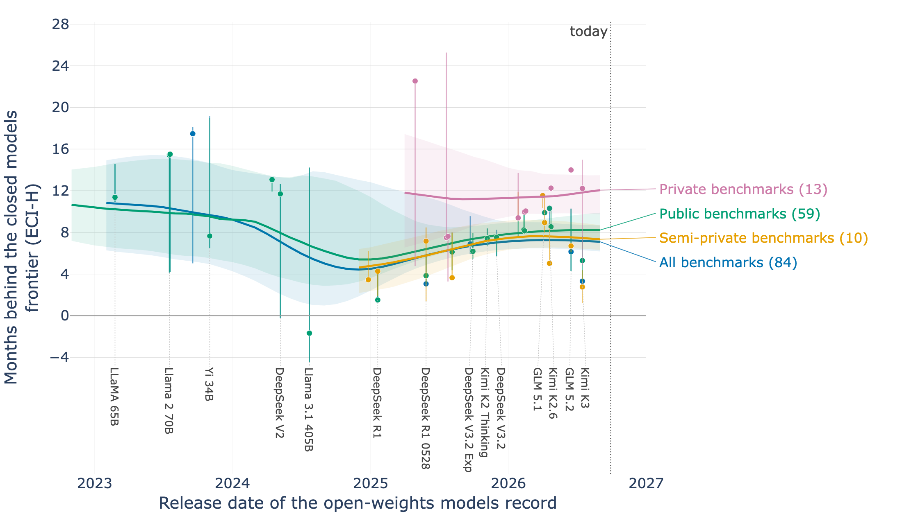
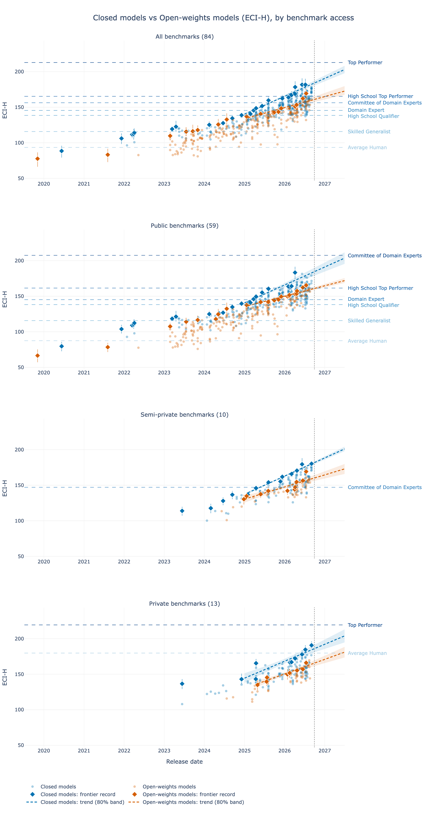

# How far behind the closed frontier are open-weights models? ECI-H by benchmark access

The question of [Ihle (2026), *How far behind are open models?*](https://www.lesswrong.com/posts/rJcCrXyEsJKmmDpWG/how-far-behind-are-open-models), asked on our ECI-H scale instead of per-benchmark score thresholds: how many months does the open-weights frontier trail the closed one, and does the answer change with the access class of the benchmarks?

Data generation 2026-09-29 (pipeline commit `ab88fee`), today pinned at 2026-09-29. Figures and tables are copies of `5_outputs/data20260929/comparisons/frontier_gap_openness_*`; French versions in `fr/`, vector twins in `fr/svg/`; the French months-behind figure is drawn in the lab's print style, with its marks (`viz.frontier_gap_print`).



## Results

Open-weights records of the last twelve months, median [80% interval]:

| | All (84) | Public (59) | Semi-private (10) | Private (13) |
|---|---|---|---|---|
| Months behind the closed frontier | 7.3 [6.5, 9.2] | 8.0 [7.1, 9.2] | 7.4 [6.3, 9.0] | 10.9 [9.1, 14.1] |

- **About eight months.** On all benchmarks the open records of the last year sit where the closed frontier stood 7.3 months earlier; the trend lines through the records say the same order of magnitude (11.0 [8.8, 12.7] months today, gap over the closed slope). The closed frontier gains 25.1 ECI-H a year against 15.5 for open weights: the gap in points is widening.
- **Private benchmarks show a longer lag**, 2.9 [0.2, 6.1] months more than public benchmarks (two fits on disjoint benchmarks, so an independent comparison). This is Ihle's direction (8-10 months private, 4-6 public), weakly. Much of it rests on one model: o3 (April 2025) is the first closed model above most 2026 open records on private benchmarks, placed 18 ECI-H higher there than on all benchmarks by its three private scores, a perfect one on Fiction.LiveBench among them.
- **Semi-private and public agree** (7.4 and 8.0 months).

The three lags per scope: [`frontier_gap_openness_table.md`](frontier_gap_openness_table.md); every quantity (slopes, gaps in ECI-H) and the differences between scopes, private − public among them, in [`frontier_gap_openness_table.csv`](frontier_gap_openness_table.csv).



## Method

- **Fits.** The canonical K=1 ECI-H fit on its 84 benchmarks (`--human-merge`, 8 x 10,000 draws) and three quick fits (4 x 2,000) on one access class each. The index leaves out, besides the benchmarks built to be easy for humans, the five mainly visual ones (VISTA, GeoBench, BlueprintBench 2, VisualToolBench, EnigmaEval: humans at or above the best models, a few labs' vision models favoured, open models rarely scored). Classes come from the pipeline: a scored set anyone can download without a human reviewing the request is public (an automatic gate counts), a held-out scored set with a released sample is semi-private (an illustrative example is not a sample), a set never released or given on reviewed request is private. The classes agree with Ihle's on all 17 benchmarks of his post. List: [`frontier_gap_openness_benchmark_classes.md`](frontier_gap_openness_benchmark_classes.md).
- **One scale.** The all-benchmarks fit is pinned by its two anchors (Claude 3.5 Sonnet Oct 2024 = 130, GPT-5 medium = 150). Each class fit is linked onto it through the closed OpenAI, Anthropic and Google models with at least four scores in the class (mean-sigma, per draw): the anchors alone hold two to four scores per class, other labs' models may be tuned to some benchmarks, and linking through open models would erase the difference being measured.
- **Open or closed** (`1_curated/model_openness.csv`): open when the weights are downloadable at release or within 30 days (GLM-5.3 open, grok-2 closed), and a hosted version of open weights is open (Qwen3.5-Plus).
- **Records.** Candidates are dated releases with at least two scores in the scope; a group's frontier is the running maximum of posterior-median ECI-H, one effort per family and one release per day. In a class, an open record only counts if the release is within 5 ECI-H of the open record of its date on all benchmarks (in 2024 the open "records" on private benchmarks were Llama 3.1 8B and Pixtral 12B, the open models that happened to be scored).
- **Months behind.** Per posterior draw, the months between an open record and the first closed model at or above it. A level the class's closed models already exceeded when first scored is read off the all-benchmarks closed frontier instead; on all and public benchmarks, where nothing precedes davinci (2020), it is dated back at the closed frontier's early rate and a record that needs this in more than two thirds of draws is dropped. Curves are 6-month Gaussian smooths of the per-draw lags.
- **Trend lines.** One straight line per group through its records since 2024-10-01, each weighted by its posterior SD plus a common dispersion; the lag today is the gap over the closed slope (how long ago the closed line stood where the open line stands).

## Caveats

- Class fits are quick fits (η r̂ ≤ 1.007, at most 30 divergences out of 8,000 on public). The private fit's own tables read ECI-H off Claude 3.7 Sonnet and GPT-5 medium (`--anchors`): Claude 3.5 Sonnet has no private score left.
- Open coverage is thin outside public benchmarks: 49 open candidates on private benchmarks against 124 closed, 9 records.
- Gaps in ECI-H points depend on the linking; lags in months do not (any positive affine map per draw leaves them unchanged).
- The human tiers of a class are placed by the few baselines left in it; on private benchmarks they sit implausibly high, and no number here reads them.
- The frontier accelerates over 2024-2026, so a straight line through the records is a summary, not a model; the record lags are the headline.

## Run

```bash
python 1_curated/3_build_model_openness.py                                   # after a sync
python 3_fit/fit.py --preset canonical --human-merge
python 3_fit/fit.py --preset canonical --access public       --human-merge --chains 4 --draws 2000 --tune 2000
python 3_fit/fit.py --preset canonical --access semi_private --human-merge --chains 4 --draws 2000 --tune 2000
python 3_fit/fit.py --preset canonical --access private      --human-merge --chains 4 --draws 2000 --tune 2000 \
    --anchors claude-3-7-sonnet-20250219,gpt-5-2025-08-07_medium   # Claude 3.5 Sonnet has no private score left
TODAY=2026-09-29 5_outputs/open_closed_frontier/make_plots.sh
```

The code is `analysis.frontier_gap`, run per scope by `4_diagnostics/1_frontier_gap.py` and put side by side by `4_diagnostics/2_plot_frontier_gap.py`. The records CSVs (`frontier_gap_openness_<scope>_records.csv`) give every open record's lag, the closed models that first beat it and the share of borrowed or dated-back draws.
