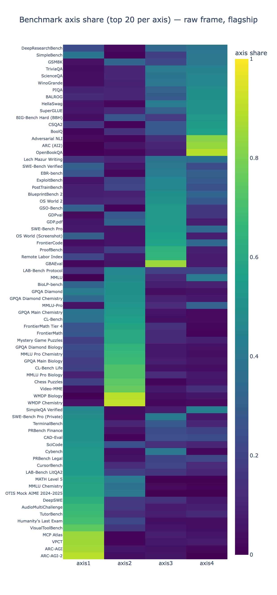

# Multi-Axis ECI

Code and data behind the forthcoming post *Multi-Axis Bayesian Epoch Capabilities Index with Human Baselines* (GPAI Policy Lab, August 2026). Its link goes here once it is published.

It follows [Mapping AI capabilities to human expertise on the Rosetta Stone scale](https://www.lesswrong.com/posts/cfbdyJGbHkY8rPesE/mapping-ai-capabilities-to-human-expertise-on-the-rosetta-1), which is a separate piece of work with its own code in [`Multi-axis-Rosetta`](https://github.com/General-Purpose-AI-Policy-Lab/Multi-axis-Rosetta). Nothing here reproduces that post.

The **Epoch Capabilities Index** ([ECI](https://epoch.ai/eci)) compresses many benchmark scores into one number per model, following the [Rosetta Stone paper](https://arxiv.org/abs/2512.00193). The previous post put human baseline tiers on that same scale, which exposed a problem. Humans score near-perfectly on abstract-reasoning benchmarks like ARC-AGI or VPCT and near chance on GPQA-type benchmarks, while many models show the opposite pattern. No single ordering produces both.

This repository rebuilds the index in PyMC as a **K-axis compensatory 2PL Beta-MIRT**, an item-response model with a Beta likelihood. Every ability comes with its uncertainty, and the nine human tiers are fitted *inside* the model as test-takers rather than plotted on top of it. One framework serves both the K=4 capability decomposition and the K=1 anchored index. Four axes come out of the fit, named after the benchmarks whose loadings are most collinear with them:



**Fluid Intelligence** (ARC-AGI-2, ARC-AGI, VPCT), **Scientific Knowledge and Reasoning** (WMDP Chemistry and Biology, the GPQA subsets, FrontierMath), **Agentic** (GBAEval, Remote Labor Index, SWE-Bench Pro) and **Legacy QA** (OpenBookQA, ARC (AI2), BoolQ and other largely saturated question-answering sets).

Scope: 4,923 observations, 829 test-takers, 96 benchmarks at K=4; 4,184 / 781 / 88 for the canonical K=1 index, which also applies the curated exclusions.

## Setup

Any Python >= 3.11 environment works.

```bash
pip install pymc arviz pytensor nutpie numpy pandas scipy plotly kaleido \
            matplotlib requests pytest
plotly_get_chrome -y   # once per env; figure export raises without it
python -m pytest -m "not slow"     # sanity check, ~4 min, 250 tests
```

Pinned working versions: pymc 5.28.5, arviz 0.23.4, pytensor 2.38.3, plotly 6.x. `nutpie` (Rust NUTS) is the default sampler, 2-3x faster than PyMC NUTS on CPU.

## Run

Main project fit with K=4.

```bash
python 2_fit.py --K 4 --human-merge --lineage-prior --lineage-bm
```

The canonical K=1 index, 10,000 draws x 8 chains, writing the full ECI deliverables to `results/canonical/`:

```bash
python 2_fit.py --preset canonical
```

ECI is the per-draw affine transform of ability pinned at Claude 3.5 Sonnet (2024-10-22) = 130 and GPT-5 (2025-08-07, medium) = 150, matching Epoch's dashboard. Every other flag, where a fit's output lands, and the plot / diagnose / dashboard commands: [docs/cli.md](docs/cli.md).

```
.
├── 1_data/              # step 1: the pipeline notebook, the curated-input builders, the tables
├── 2_fit.py             # step 2: the fit CLI (canonical preset + exploration)
├── 3_diagnostics/       # step 3: post-fit tools, the numbered four in reproduction order
├── multiaxis_eci/       # the library: config, data loading, models, analysis, figures
├── notebooks/           # one-off investigations, kept for the record, not maintained
├── evals/               # local eval harnesses (LAB-Bench cloning); needs OPENROUTER_API_KEY
├── results/             # one folder per fit; canonical/ is the index
├── deliverables/        # figure + table sets built for a specific write-up
├── docs/                # model math, CLI reference, figure catalogue
├── tests/               # fast unit tests + golden logp locks
└── index.html           # the all-fits dashboard (tracked)
```

Numbered entries are the reproduction path, in order. Everything else is a library, an output folder or a reference. Inside `1_data/` and `3_diagnostics/` the same rule applies.

Full model math, priors and identification: [docs/model_math.md](docs/model_math.md). Figures and how to read them: [docs/plots.md](docs/plots.md). What each post-fit script does: [3_diagnostics/README.md](3_diagnostics/README.md). What each notebook investigated: [notebooks/README.md](notebooks/README.md).

## Method

Each test-taker *m* has K abilities θ forming a skill profile, the way a student can be strong in algebra and weak in essay writing. Each benchmark weighs those skills through K non-negative loadings *A*, which also set how sharply it separates test-takers, what psychometrics calls discrimination. Difficulty *D* is the bar the weighted skills must clear, and a chance floor *c*, fixed per benchmark and never estimated, starts the curve where guessing does:

<p align="center"><em>µ = c<sub>b</sub> + (1 − c<sub>b</sub>) σ( Σ<sub>k</sub> A<sub>b,k</sub> θ<sub>m,k</sub> − D<sub>b</sub> )</em>,  &nbsp; observed <em>y ~ Beta(µφ<sub>b</sub>, (1−µ)φ<sub>b</sub>)</em></p>

This is the *compensatory* family: a strong skill can make up for a weak one inside the sum. The non-compensatory and semi-compensatory alternatives are implemented too (`multiaxis_eci/fits/fit_nc.py`, `multiaxis_eci/fits/fit_interaction.py`); the first did not converge, the second converged only under heavy constraints and predicted worse.

**The data is sparse.** The test-taker by benchmark matrix is filled at about 6%, and the average test-taker has six scores. Many arrangements of abilities and loadings explain those scores equally well, so unconstrained runs land on different solutions. Two ordering priors identify the fit:

- `--human-merge` sets a **hard** partial order on the human tiers. A Domain Expert is at least as good as a Skilled Generalist, a committee at least as good as its members, on every axis. It says nothing about the size of the gaps, and leaves genuinely incomparable tiers unordered.
- `--lineage-prior --lineage-bm` add a **soft** prior along each vendor's release chain. A release is nudged above its predecessor, more over a longer gap, but can regress if the data says so. Thinking-effort variants attach to their base release and are not ordered among themselves.

Without priors the runs split into two sets of axes; with the human ordering alone they still disagree; with both, they agree. On leave-one-out cross-validation the final model beats the no-prior version by about 107 ± 18 and the 1D index by about 1,000 ± 33.

Four things are on by default with no flag over them: non-negative loadings, the fixed-c chance floors, hierarchical benchmark noise, and four retired benchmarks (FrontierMath v1, FrontierMath Tier 4 v1, AlgoTune, MindCube) dropped at load time for every fit. Each has an opt-out documented in [docs/cli.md](docs/cli.md).

## Reading the results

**Axes have no fixed names, so they are labelled after sampling.** Swapping two axes leaves every prediction unchanged, because the swap moves the loadings `A` and the abilities `theta` together and only their product reaches the likelihood. Each draw picks its own labels, and they are fixed afterwards: within every draw axes are sorted strongest first. So "axis 2" means "the second strongest axis" in every draw.

Whether the chains agree on those axes is a different question, with its own number. Each chain's mean loading columns are matched to the pooled mean over every permutation and sign (all 24 of them at K=4), and the median correlation is reported per axis. Nothing is relabelled by this; the number says which axis the chains disagree about, which the identified r-hat cannot. Convergence is judged on identified quantities only (`eta`, `D`, `sigma_b`), because raw per-axis r-hat on `A` and `theta` is permutation-inflated.

**An ability is trustworthy only where it was measured.** A test-taker's ability on an axis rests on benchmarks that load on that axis. Models from 2021-2023 took only easy benchmarks, so their hard-axis ability is extrapolated, not measured, and can land high with a wide interval. Figures drop those rows through `mirt_informed_mask` (posterior SD < 0.4); the fit and the diagnostics keep every row.

**`results/canonical/trace.nc` predates the current data snapshot.** Re-fit before quoting any canonical number. The tracked `index.html` cannot be rebuilt from a fresh clone either: it renders from the `.nc` traces, which are gitignored (the K=4 trace alone is 38 GB). Treat the committed dashboard as a published artifact of the snapshot it was built from.

## Limitations

- **Data.** We need more of it and of better quality, especially for the human baselines. The 6% fill rate is what forced the extra assumptions above.
- **Benchmark-level scores.** We fit those rather than item-level answers, so the MIRT assumptions are not fully respected. The Rosetta Stone paper and the ECI have the same problem.
- **Calibration.** The predictive intervals come out wider than the data requires, which makes the model more conservative than it should be.

On the **Legacy QA** axis specifically, the human lead is a comparison against a frozen pool of pre-mid-2024 models. The eight benchmarks that define the axis most purely were never run on a frontier model, so this is a data artifact rather than a finding. The axis is left out of the headline forecasts (it gets no SOTA exemption), though the dashboard still renders its panel for diagnostic purposes.

## Data

`multiaxis_eci/data.py` reads `1_data/processed/benchmarks_merged.csv`, produced by the in-repo notebook `1_data/1_pipeline/pipeline.ipynb` (Restart Kernel → Run All; see [1_data/1_pipeline/README.md](1_data/1_pipeline/README.md)).

That notebook is being superseded by [`eval-data-pipeline`](https://github.com/General-Purpose-AI-Policy-Lab/eval-data-pipeline), a standalone repository covering the same feeds with a UUID-keyed schema and a determinism check. The migration is not done: this repo still fits the in-repo notebook's output, and the two schemas are not interchangeable yet.

## Resources

- Epoch Capabilities Index: <https://epoch.ai/eci>
- Rosetta Stone paper: <https://arxiv.org/abs/2512.00193>
- Alexander Barry's Bayesian ECI, which this rebuild follows: [Kicking the tires of the Epoch Capabilities Index](https://abstatisticalconsulting.substack.com/p/kicking-the-tires-of-the-epoch-capabilities-741)
- Epoch on benchmark scores carrying more than one dimension: [Benchmark Scores = General Capability + Claudiness](https://epoch.ai/gradient-updates/benchmark-scores-general-capability-claudiness)

## License

CC-BY-4.0 ([LICENSE](LICENSE)) over the code, the analysis layer, `1_data/curated/` and `results/`.

The upstream benchmark scores carry their own terms. Epoch AI is CC-BY and requires attribution, RAND is cited under RR-A3797-1, and Scale SEAL has no open license. What to credit when republishing: [NOTICE.md](NOTICE.md).
