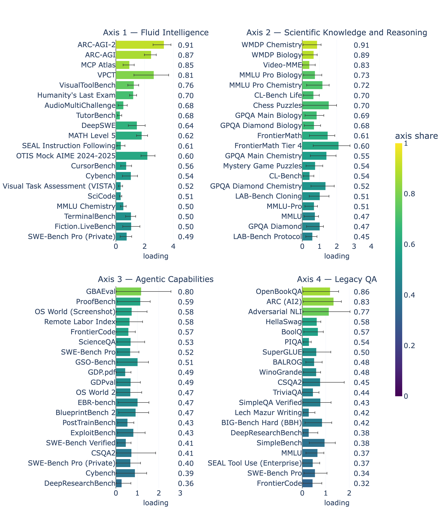
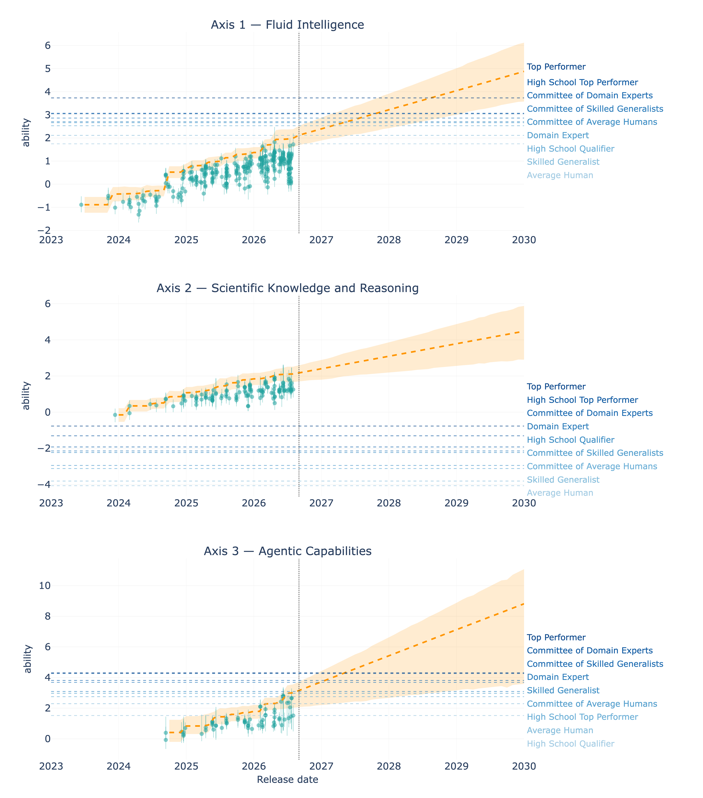

# Multi-Axis ECI

Code and data behind the post [*Multi-Axis Bayesian Epoch Capabilities Index with Human Baselines*](https://gpaipolicylab.org/blog-5) (GPAI Policy Lab, 2026). It follows [Mapping AI capabilities to human expertise on the Rosetta Stone scale](https://www.lesswrong.com/posts/cfbdyJGbHkY8rPesE/mapping-ai-capabilities-to-human-expertise-on-the-rosetta-1), see [`rosetta-human-baselines`](https://github.com/General-Purpose-AI-Policy-Lab/rosetta-human-baselines).

The **Epoch Capabilities Index** ([ECI](https://epoch.ai/eci)) compresses many benchmark scores into one number per model, following the [Rosetta Stone paper](https://arxiv.org/abs/2512.00193). The previous post put human baseline tiers on that same scale, which exposed a problem. Humans score near-perfectly on abstract-reasoning benchmarks like ARC-AGI or VPCT and near chance on GPQA-type benchmarks, while many models show the opposite pattern. No single ordering produces both.

This repository rebuilds the index in PyMC as a **K-axis compensatory 2PL Beta-MIRT**, an item-response model with a Beta likelihood. Every ability comes with its uncertainty, and the nine human tiers are fitted *inside* the model as test-takers rather than plotted on top of it. One framework serves both the K=4 capability decomposition and the K=1 anchored index, which we call **ECI-H** (ECI with Human baselines) to keep it distinct from Epoch's published ECI. Four axes come out of the fit, named after the benchmarks whose loadings are most collinear with them:
1. **Fluid Intelligence** (ARC-AGI-2, ARC-AGI, VPCT)
2. **Scientific Knowledge and Reasoning** (WMDP Chemistry and Biology, the GPQA subsets, FrontierMath)
3. **Agentic Capabilities** (GBAEval, Remote Labor Index, SWE-Bench Pro)
4. **Legacy QA** (OpenBookQA, ARC (AI2), BoolQ and other largely saturated question-answering sets).






Scope of the published fits: 4,923 observations, 829 test-takers, 96 benchmarks at K=4; 4,184 / 781 / 88 for the canonical K=1 index, which also applies the curated exclusions. On the pipeline build of 2026-09-07 the same scopes hold 5,402 / 905 / 97 and 4,571 / 846 / 89 (see the Data section).

## Setup

Python 3.11 or later, with the pinned scientific stack (`pyproject.toml`):

```bash
uv venv --python 3.11 .venv && uv pip install -e . --group dev   # or: pip install -e .
plotly_get_chrome -y                                             # once per env; figure export needs it
python -m multiaxis_eci sync                                     # 0_input/ from ../benchmark-data-pipeline
python -m pytest -m "not slow"                                   # ~1 min, ~260 tests
ruff check .
```

The pins are load-bearing: arviz >= 1.0 replaces `InferenceData` with xarray's `DataTree`, and nutpie >= 0.16.8 hands a `DataTree` back from a zarr store, either of which breaks this code and the golden logp tests. `nutpie` (Rust NUTS) is the default sampler, 2-3x faster than PyMC NUTS on CPU.

## Data

The scores, release dates, organizations, countries, categories, chance floors, known ceilings, access classes and human baselines all come from [`benchmark-data-pipeline`](https://github.com/General-Purpose-AI-Policy-Lab/benchmark-data-pipeline). `python -m multiaxis_eci sync` copies its consumer views and tables from a checkout (the sibling directory by default, `--pipeline PATH` otherwise) into `0_input/`, and writes `provenance.json` with the pipeline commit and build date. The copies are tracked, so a fit is reproducible without the pipeline. Anything wrong in the data (a date, an alias, a floor, a benchmark's inclusion) is fixed in the pipeline, then synced here.

Two modeling-stage filters apply at load time: the curated exclusion list below, and the drop of isolated families, every release (base model plus snapshot, all reasoning efforts and run variants together) whose observations sit on a single benchmark in the fit's scope. Such a family carries no cross-benchmark information, and the 2020-2022 tail of them fed a second posterior mode on the legacy QA series; `--keep-isolated-families` restores them.

What stays in this repository is what belongs to the model, under `1_curated/`: the "easy for humans" exclusion list of the canonical K=1 index, the reviewed lineage map and its overrides, the data-driven SOTA list, the reviewed clips of below-floor scores, the optional SimpleQA original column and Epoch's reference ECI table. See [`1_curated/README.md`](1_curated/README.md).

The data generation is part of every output folder name: `results/canonical_data20260907/` was fitted on the pipeline build of 2026-09-07 (`config.DATA_SUFFIX`), so a fit on a newer build never overwrites an older one. The results published with the post (`results/canonical/`, `results/mirt_*/`, `index.html`) were fitted on the pre-pipeline dataset described in the post; they are kept as they were.

## Run

Main project fit with K=4.

```bash
python 3_fit.py --K 4 --human-merge --lineage-prior --lineage-bm
```

The canonical K=1 index, 10,000 draws x 8 chains, writing the full ECI-H deliverables to `results/canonical<data suffix>/`:

```bash
python 3_fit.py --preset canonical
```

ECI-H is the per-draw affine transform of ability pinned at Claude 3.5 Sonnet (2024-10-22) = 130 and GPT-5 (2025-08-07, medium) = 150, matching the scale of Epoch's dashboard. Every other flag, where a fit's output lands, and the plot / diagnose / dashboard commands: [docs/cli.md](docs/cli.md).

```
.
├── 0_input/             # step 0: the pipeline's views and tables, synced (all_scores_flat, human_baselines, models, benchmarks, manifest, provenance)
├── 1_curated/           # step 1: inputs specific to this model, and the two builders (SOTA list, lineage map)
├── 2_model/multiaxis_eci/  # step 2: the library: config, data loading, models, analysis, figures, sync
├── 3_fit.py             # step 3: the fit CLI (canonical preset + exploration)
├── 4_diagnostics/       # step 4: post-fit tools, the numbered four in reproduction order
├── notebooks/           # one-off investigations, kept for the record, not maintained
├── evals/               # local eval harnesses (LAB-Bench cloning); needs OPENROUTER_API_KEY
├── results/             # one folder per fit; canonical/ is the published index, Old/ the archive
├── plots/               # figures per fit (gitignored, regenerable)
├── blogpost/            # the research post's figures and its LOO ladder (the deliverable)
├── deliverables/        # figure + table sets built for a specific write-up
├── docs/                # model math, CLI reference, figure catalogue
├── tests/               # fast unit tests + golden logp locks
└── index.html           # the all-fits dashboard (tracked)
```

Numbered entries are the reproduction path, in order. Everything else is a library, an output folder or a reference. Inside `1_curated/` and `4_diagnostics/` the same rule applies.

Full model math, priors and identification: [docs/model_math.md](docs/model_math.md). Figures and how to read them: [docs/plots.md](docs/plots.md). What each post-fit script does: [4_diagnostics/README.md](4_diagnostics/README.md). What each notebook investigated: [notebooks/README.md](notebooks/README.md).

## Method

Each test-taker *m* has K abilities θ forming a skill profile, the way a student can be strong in algebra and weak in essay writing. Each benchmark weighs those skills through K non-negative loadings *A*, which also set how sharply it separates test-takers, what psychometrics calls discrimination. Difficulty *D* is the bar the weighted skills must clear, and a chance floor *c*, fixed per benchmark and never estimated, starts the curve where guessing does:

<p align="center"><em>µ = c<sub>b</sub> + (1 − c<sub>b</sub>) σ( Σ<sub>k</sub> A<sub>b,k</sub> θ<sub>m,k</sub> − D<sub>b</sub> )</em>,  &nbsp; observed <em>y ~ Beta(µφ<sub>b</sub>, (1−µ)φ<sub>b</sub>)</em></p>

This is the *compensatory* family: a strong skill can make up for a weak one inside the sum. The non-compensatory and semi-compensatory alternatives are implemented too (`multiaxis_eci/fits/fit_nc.py`, `multiaxis_eci/fits/fit_interaction.py`); the first did not converge, the second converged only under heavy constraints and predicted worse.

**The data is sparse.** The test-taker by benchmark matrix is filled at about 6%, and the average test-taker has six scores. Many arrangements of abilities and loadings explain those scores equally well, so unconstrained runs land on different solutions. Two ordering priors identify the fit:

- `--human-merge` sets a **hard** partial order on the human tiers. A Domain Expert is at least as good as a Skilled Generalist, a committee at least as good as its members, on every axis. It says nothing about the size of the gaps, and leaves genuinely incomparable tiers unordered.
- `--lineage-prior --lineage-bm` add a **soft** prior along each vendor's release chain. A release is nudged above its predecessor, more over a longer gap, but can regress if the data says so. Thinking-effort variants attach to their base release and are not ordered among themselves.

Without priors the runs split into two sets of axes; with the human ordering alone they still disagree; with both, they agree. On leave-one-out cross-validation the final model beats the no-prior version by about 107 ± 18 and the 1D index by about 1,000 ± 33.

Three things are on by default with no flag over them: non-negative loadings, the fixed-c chance floors (the pipeline's `lower_bound`), and hierarchical benchmark noise. Each has an opt-out documented in [docs/cli.md](docs/cli.md). Benchmarks retired for measurement validity (FrontierMath v1, AlgoTune, MindCube) are excluded by the pipeline itself.

## Reading the results

**Axes have no fixed names, so they are labelled after sampling.** Swapping two axes leaves every prediction unchanged, because the swap moves the loadings `A` and the abilities `theta` together and only their product reaches the likelihood. Each draw picks its own labels, and they are fixed afterwards: within every draw axes are sorted strongest first. So "axis 2" means "the second strongest axis" in every draw.

Whether the chains agree on those axes is a different question, with its own number. Each chain's mean loading columns are matched to the pooled mean over every permutation and sign (all 24 of them at K=4), and the median correlation is reported per axis. Nothing is relabelled by this; the number says which axis the chains disagree about, which the identified r-hat cannot. Convergence is judged on identified quantities only (`eta`, `D`, `sigma_b`), because raw per-axis r-hat on `A` and `theta` is permutation-inflated.

**An ability is trustworthy only where it was measured.** A test-taker's ability on an axis rests on benchmarks that load on that axis. Models from 2021-2023 took only easy benchmarks, so their hard-axis ability is extrapolated, and can land high with a wide interval. Figures drop those rows through `mirt_informed_mask` (posterior SD < 0.33); the fit and the diagnostics keep every row.

## Limitations

- **Data.** We need more of it and of better quality, especially for the human baselines. The 6% fill rate is what forced the extra assumptions above.
- **Benchmark-level scores.** We fit those rather than item-level answers, so the MIRT assumptions are not fully respected. The Rosetta Stone paper and the ECI have the same problem.
- **Calibration.** The predictive intervals come out wider than the data requires, which makes the model more conservative than it should be.

On the **Legacy QA** axis specifically, the human lead is a comparison against a frozen pool of pre-mid-2024 models. The eight benchmarks that define the axis most purely were never run on a frontier model, so this is a data artifact rather than a finding. The axis is left out of the headline forecasts (it gets no SOTA exemption), though the dashboard still renders its panel for diagnostic purposes.

## Resources

- Epoch Capabilities Index: <https://epoch.ai/eci>
- Rosetta Stone paper: <https://arxiv.org/abs/2512.00193>
- Alexander Barry's Bayesian ECI, which this rebuild follows: [Kicking the tires of the Epoch Capabilities Index](https://abstatisticalconsulting.substack.com/p/kicking-the-tires-of-the-epoch-capabilities-741)
- Epoch on benchmark scores carrying more than one dimension: [Benchmark Scores = General Capability + Claudiness](https://epoch.ai/gradient-updates/benchmark-scores-general-capability-claudiness)

## License

CC-BY-4.0 ([LICENSE](LICENSE)) over the code, the analysis layer, `1_curated/` and `results/`.

The upstream benchmark scores carry their own terms. Epoch AI is CC-BY and requires attribution, RAND is cited under RR-A3797-1, and Scale SEAL has no open license. What to credit when republishing: [NOTICE.md](NOTICE.md).
