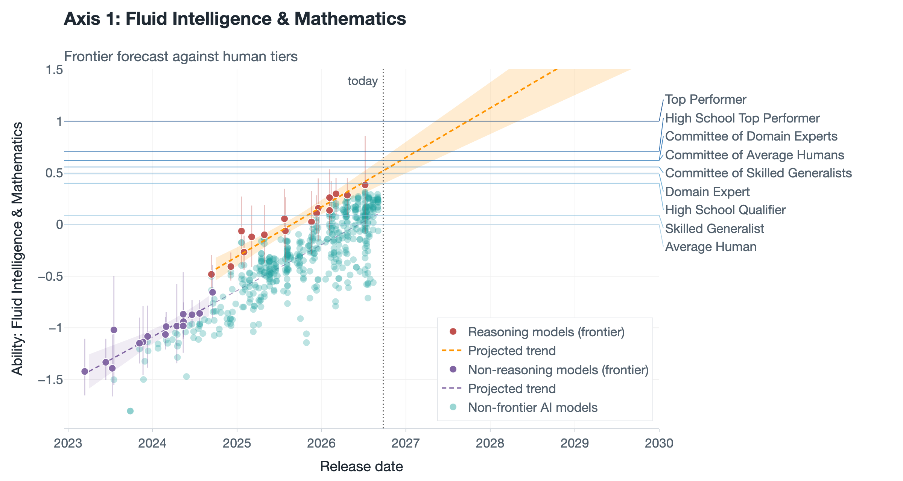
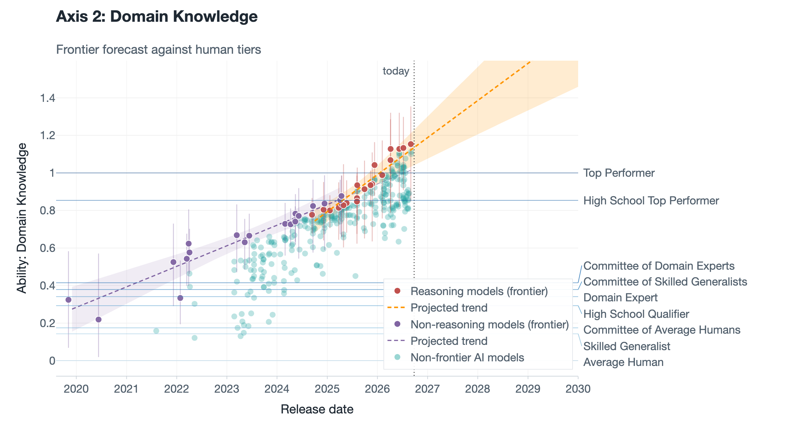
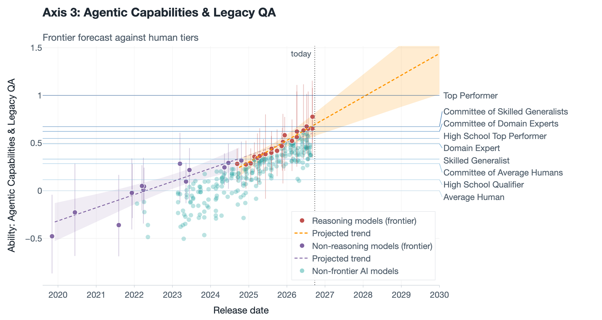
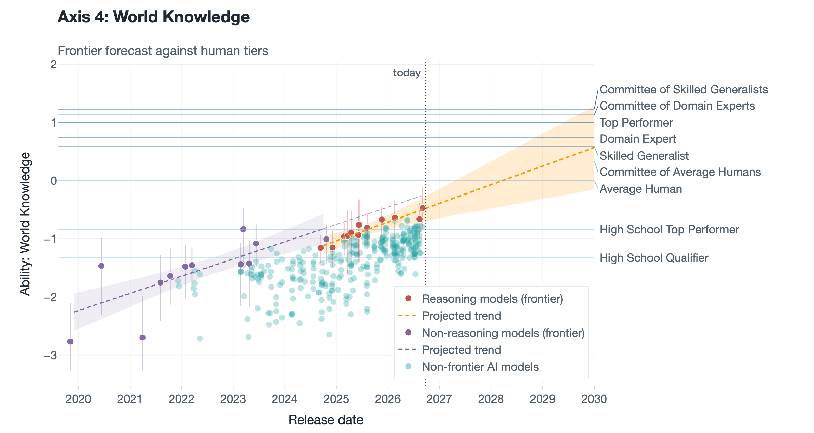
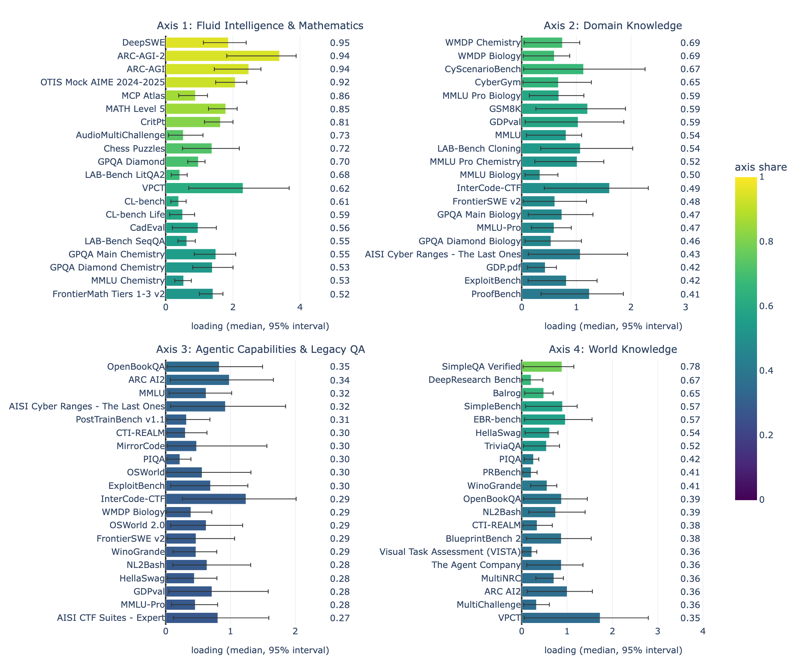

# Multi-Axis ECI

A multi-axis, Bayesian version of the **Epoch Capabilities Index** ([ECI](https://epoch.ai/eci)) with human baselines fitted inside the model, and the frontier forecasts it supports.

The method was published in [*Multi-Axis Bayesian Epoch Capabilities Index with Human Baselines*](https://gpaipolicylab.org/blog-5) (GPAI Policy Lab, 2026-09-07). That post was fitted on the pre-pipeline dataset, and its code, data and results are frozen on the branch [`blogpost-frozen`](https://github.com/General-Purpose-AI-Policy-Lab/Multiaxis_ECI/tree/blogpost-frozen); its tables stay on `main` under `5_outputs/pre_pipeline/`. `main` has moved on since: the data now comes from [`benchmark-data-pipeline`](https://github.com/General-Purpose-AI-Policy-Lab/benchmark-data-pipeline), the human tiers follow one merged partial order, the forecast fits reasoning and non-reasoning models separately, and the flagship was refitted on the pipeline build of 2026-09-08. This README describes `main`; where a number comes from the post, it says so.

## The idea

The ECI compresses many benchmark scores into one number per model, following the [Rosetta Stone paper](https://arxiv.org/abs/2512.00193). The previous post, [Mapping AI capabilities to human expertise on the Rosetta Stone scale](https://www.lesswrong.com/posts/cfbdyJGbHkY8rPesE/mapping-ai-capabilities-to-human-expertise-on-the-rosetta-1) (code: [`rosetta-human-baselines`](https://github.com/General-Purpose-AI-Policy-Lab/rosetta-human-baselines)), put human baseline tiers on that scale, which exposed a problem. Humans score near-perfectly on abstract-reasoning benchmarks like ARC-AGI or VPCT and near chance on GPQA-type benchmarks, while many models show the opposite pattern. No single ordering produces both.

This repository rebuilds the index in PyMC as a **K-axis compensatory 2PL Beta-MIRT**, an item-response model with a Beta likelihood. Every ability comes with its uncertainty, and the human tiers (nine at K=4: six individual tiers from the Average Human to the Top Performer, and three committees) are fitted *inside* the model as test-takers rather than plotted on top of it. One framework serves both the K=4 capability decomposition and the K=1 anchored index, which we call **ECI-H** (ECI with Human baselines) to keep it distinct from Epoch's published ECI.

## Current results: the K=4 flagship on the 2026-09-08 build

The axes carry no names of their own. They are named by hand after the benchmarks that load most on them, in the fit folder's `axis_names.json`, and a refit keeps a name only while its signature benchmarks still define the axis (see [docs/plots.md](docs/plots.md)). The current flagship's four:

1. **Fluid Intelligence & Mathematics** (ARC-AGI-2, ARC-AGI, OTIS Mock AIME)
2. **Domain Knowledge** (WMDP Biology and Chemistry)
3. **Agentic Capabilities & Legacy QA** (OSWorld, GBAEval, OpenBookQA, ARC (AI2))
4. **World Knowledge** (SimpleQA Verified, DeepResearch Bench)

The eight chains of this fit fall into three posterior modes (see [Limitations](#limitations)). The figures below follow the largest, chains 2, 5, 6 and 7; the fit's figure folder renders the remaining chains separately, under `minority/`.

Per axis, the frontier releases of reasoning models (red) and of the others (purple) each get their own fitted line; the reasoning models' line is projected to 2030 (orange, 80% band) against the human tiers (horizontal lines). Abilities are in human units: the Average Human at 0 and the Top Performer at 1 on every axis.

<p>




</p>

The 20 benchmarks with the largest share of each axis, their loadings (median and 95% interval) and that share:



`python docs/make_readme_figures.py` redraws these five figures from the current flagship trace, with the builders of the per-fit folders.

The K=4 fit sees 5,307 observations, 802 test-takers and 97 benchmarks; the canonical K=1 index, which also applies the curated exclusions, 4,461 / 727 / 89. The post's fits saw 4,923 / 829 / 96 and 4,184 / 781 / 88.

## Setup

Python 3.11 or later, with the pinned scientific stack (`pyproject.toml`):

```bash
uv venv --python 3.11 .venv && uv pip install -e . --group dev   # or: pip install -e .
plotly_get_chrome -y                                             # once per env; figure export needs it
python -m multiaxis_eci sync                                     # 0_input/ from ../benchmark-data-pipeline
python -m pytest -m "not slow"                                   # under a minute, about 290 tests
ruff check .
```

On macOS with the Command Line Tools for Xcode 27 or later, PyTensor's C compiles would fail on the `-ld64` flag it adds for the classic linker; importing `multiaxis_eci` installs a shim that strips the flag once the linker is seen to refuse it (`multiaxis_eci/pytensor_compat.py`, to be removed when PyTensor stops adding it).

The pins are load-bearing: arviz >= 1.0 replaces `InferenceData` with xarray's `DataTree`, and nutpie >= 0.16.8 hands a `DataTree` back from a zarr store, either of which breaks this code and the golden logp tests. `nutpie` (Rust NUTS) is the default sampler, 2-3x faster than PyMC NUTS on CPU.

## Data

The scores, release dates, organizations, countries, categories, chance floors, known ceilings, access classes and human baselines all come from [`benchmark-data-pipeline`](https://github.com/General-Purpose-AI-Policy-Lab/benchmark-data-pipeline). `python -m multiaxis_eci sync` copies its consumer views and tables from a checkout (the sibling directory by default, `--pipeline PATH` otherwise) into `0_input/`, and writes `provenance.json` with the pipeline commit and build date. The copies are tracked, so a fit is reproducible without the pipeline. Anything wrong in the data (a date, an alias, a floor, a benchmark's inclusion) is fixed in the pipeline, then synced here. Benchmarks retired for measurement validity (FrontierMath v1, AlgoTune, MindCube) never reach `0_input/`.

Two modeling-stage filters apply at load time: the curated exclusion list below, and the drop of isolated families, every release (base model plus snapshot, all reasoning efforts and run variants together) whose observations sit on a single benchmark in the fit's scope. Such a family carries no cross-benchmark information, and the 2020-2022 tail of them fed a second posterior mode on the legacy QA series; `--keep-isolated-families` restores them.

What stays in this repository is what belongs to the model, under `1_curated/`: the "easy for humans" exclusion list of the canonical K=1 index, the reviewed lineage map and its overrides, the data-driven SOTA list, the reviewed clips of below-floor scores, the models' openness labels, the optional SimpleQA original column and Epoch's reference ECI table. See [`1_curated/README.md`](1_curated/README.md).

Every output goes under `5_outputs/<data generation>/`, named after the pipeline build it was fitted on (`config.DATA_TAG`): the current flagship is `5_outputs/data20260908/mirt_humanmerge_lineageprior_lineagebm/`, the canonical K=1 index `5_outputs/data20260908/canonical_humanmerge/`. A fit on a newer build never overwrites an older one. `5_outputs/pre_pipeline/` holds the post's fits as they were published; the K=4 trace was deleted and is regenerated from `blogpost-frozen` (`5_outputs/pre_pipeline/mirt_humanmerge_lineageprior_lineagebm/REGENERATE.md`).

## Run

The K=4 flagship at full length, 10,000 draws after 2,000 tuning steps on each of 8 chains (an exploration fit without `--draws` samples 2,000 x 2,000, a quarter of the run):

```bash
python 3_fit/fit.py --K 4 --human-merge --lineage-prior --lineage-bm --draws 10000 --tune 2000
```

Traces on disk keep every fifth draw (`--save-thin`, `config.SAVE_THIN`): convergence and the tables are computed on the full run, and the 16,000 saved draws pin every median and interval the figures show. While a nutpie fit runs, its draws stream to a zarr store beside the trace instead of accumulating in RAM (`--stream-draws`, on by default; `--no-stream-draws` restores the in-memory run), so the machine stays usable during a ten-hour fit; the store is deleted once the thinned trace is saved.

Then find the posterior modes, render the fit's figures (on the majority chains and, separately, the remaining ones when there are several modes; French versions under `fr/`, their SVG twins under `fr/svg/`), and rebuild the dashboard:

```bash
python 4_diagnostics/diagnose_chains.py --trace <trace> --write-modes
python 4_diagnostics/3_plot_mirt.py --forecast --trace <trace>
python 4_diagnostics/4_build_dashboard.py
```

The canonical K=1 index, 10,000 draws x 8 chains, writing the full ECI-H deliverables to `5_outputs/<data generation>/canonical_humanmerge/`:

```bash
python 3_fit/fit.py --preset canonical --human-merge
```

`--human-merge` is the human tier order every analysis uses (decision 2026-09-14). It is deliberately not a default: no fit imposes an order on the human tiers without saying so in its folder name. The flat `--human-prior` is a sensitivity variant, and a run with neither writes to plain `canonical/`.

ECI-H is the per-draw affine transform of ability pinned at Claude 3.5 Sonnet (2024-10-22) = 130 and GPT-5 (2025-08-07, medium) = 150, matching the scale of Epoch's dashboard. Every other flag, where a fit's output lands, and the plot / diagnose / dashboard commands: [docs/cli.md](docs/cli.md).

## Layout

```
.
├── 0_input/             # step 0: the pipeline's views and tables, synced (all_scores_flat, human_baselines, models, benchmarks, manifest, provenance)
├── 1_curated/           # step 1: inputs specific to this model, and the three builders (SOTA list, lineage map, model openness)
├── 2_model/multiaxis_eci/  # step 2: the library: config, data loading, models, analysis, figures, sync
├── 3_fit/fit.py         # step 3: the fit CLI (canonical preset + exploration)
├── 4_diagnostics/       # step 4: post-fit tools, the numbered four in reproduction order
├── 5_outputs/           # step 5: everything a fit writes, one folder per data generation (data<YYYYMMDD>/), then per fit: tables, trace, figures/; pre_pipeline/ holds the post's fits, open_closed_frontier/ the open-weights vs closed frontier note
├── 6_writeups/          # step 6: the post's figure scripts (blogpost/), the dashboard's card registry
├── internal_evals/      # the lab's own scoring runs (LAB-Bench cloning through OpenRouter); needs OPENROUTER_API_KEY
├── archive/             # kept for the record, not maintained: notebooks (one-off investigations), results_old (superseded fits)
├── docs/                # model math, CLI reference, figure catalogue, the README's figures (figures/, make_readme_figures.py)
├── tests/               # fast unit tests + golden logp locks
└── index.html           # the dashboard of the current fits (tracked, served as is)
```

Numbered entries are the reproduction path, in order: inputs, curation, model, fit, diagnostics, outputs, write-ups. Everything else is a reference. Inside `1_curated/` and `4_diagnostics/` the same rule applies.

Full model math, priors and identification: [docs/model_math.md](docs/model_math.md). Figures and how to read them: [docs/plots.md](docs/plots.md). What each post-fit script does: [4_diagnostics/README.md](4_diagnostics/README.md). What each notebook investigated: [archive/notebooks/README.md](archive/notebooks/README.md).

## Method

Each test-taker *m* has K abilities θ forming a skill profile, the way a student can be strong in algebra and weak in essay writing. Each benchmark weighs those skills through K non-negative loadings *A*, which also set how sharply it separates test-takers, what psychometrics calls discrimination. Difficulty *D* is the bar the weighted skills must clear, and a chance floor *c*, fixed per benchmark and never estimated, starts the curve where guessing does:

<p align="center"><em>µ = c<sub>b</sub> + (1 − c<sub>b</sub>) σ( Σ<sub>k</sub> A<sub>b,k</sub> θ<sub>m,k</sub> − D<sub>b</sub> )</em>,  &nbsp; observed <em>y ~ Beta(µφ<sub>b</sub>, (1−µ)φ<sub>b</sub>)</em></p>

This is the *compensatory* family: a strong skill can make up for a weak one inside the sum. The non-compensatory and semi-compensatory alternatives are implemented too (`multiaxis_eci/fits/fit_nc.py`, `multiaxis_eci/fits/fit_interaction.py`); the first did not converge, the second converged only under heavy constraints and predicted worse.

**The data is sparse.** The test-taker by benchmark matrix is filled at about 6%, and the average test-taker has six scores. Many arrangements of abilities and loadings explain those scores equally well, so unconstrained runs land on different solutions. Two ordering priors identify the fit:

- `--human-merge` sets a **hard** partial order on the human tiers. A Domain Expert is at least as good as a Skilled Generalist, a committee at least as good as its members, on every axis. It says nothing about the size of the gaps, and leaves genuinely incomparable tiers unordered.
- `--lineage-prior --lineage-bm` add a **soft** prior along each vendor's release chain. A release is nudged above its predecessor, more over a longer gap, but can regress if the data says so. Thinking-effort variants attach to their base release and are not ordered among themselves.

Both are needed. On the post's data, runs without priors split into two sets of axes, the human ordering alone left them in disagreement, and both together brought them into agreement; on leave-one-out cross-validation that model beat the no-prior version by about 107 ± 18 and the 1D index by about 1,000 ± 33. On the 2026-09-08 build, dropping the lineage prior leaves the eight chains on eight separate solutions, hundreds of nats apart (`5_outputs/data20260908/mirt_humanmerge/README.md`); with both priors the chains still fall into three modes (see [Limitations](#limitations)).

Three things are on by default with no flag over them: non-negative loadings, the fixed-c chance floors (the pipeline's `lower_bound`), and hierarchical benchmark noise. Each has an opt-out documented in [docs/cli.md](docs/cli.md).

**The forecast** starts from the models evaluated on an axis, keeps one effort per family (the best) and one release per organization and day, and splits them into reasoning models and the others. Each regime's frontier (the running top two by release date) gets one straight line, fitted on the posterior medians and weighted by their posterior SD; the reasoning line is projected from the first reasoning release to 2030, and crossing dates read the piecewise frontier against each human tier. The full rule: [docs/plots.md](docs/plots.md).

## Reading the results

**Axes have no fixed names, so they are labelled after sampling.** Swapping two axes leaves every prediction unchanged, because the swap moves the loadings `A` and the abilities `theta` together and only their product reaches the likelihood. Each draw picks its own labels, and they are fixed afterwards: within every draw axes are sorted strongest first. So "axis 2" means "the second strongest axis" in every draw.

Whether the chains agree on those axes is a different question, with its own number. Each chain's mean loading columns are matched to the pooled mean over every permutation and sign (all 24 of them at K=4), and the median correlation is reported per axis. Nothing is relabelled by this; the number says which axis the chains disagree about, which the identified r-hat cannot. Convergence is judged on identified quantities only (`eta`, `D`, `sigma_b`), because raw per-axis r-hat on `A` and `theta` is permutation-inflated.

**An ability is trustworthy only where it was measured.** A test-taker's ability on an axis rests on benchmarks that load on that axis. Models from 2021-2023 took only easy benchmarks, so their hard-axis ability is extrapolated, and can land high with a wide interval. Figures and forecasts use a model on an axis only where its own scores cover that axis (`candidate_mask`: the axis shares of the benchmarks it was run on sum to at least 1); the fit and the diagnostics keep every row.

## Limitations

- **The K=4 flagship is not fully converged.** Its eight chains fall into three posterior modes: chains 2, 5, 6 and 7 (the figures above), chain 4 alone, and chains 0, 1 and 3, about 14 nats of log-density below the best. Over all chains the identified r-hat is 1.10, within the majority 1.02. The figures and forecasts are therefore drawn on the majority chains, the remaining chains rendered apart; the whole-fit tables pool every chain. The canonical K=1 index converges (r-hat 1.002).
- **Axis 3 is the least defined.** It gathers agentic benchmarks and saturated question-answering sets, and no benchmark puts much more than a third of its loading on it, against over 0.9 for the top benchmarks of axis 1. Read its forecast with that in mind.
- **Data.** We need more of it and of better quality, especially for the human baselines. The 6% fill rate is what forced the extra assumptions above.
- **Benchmark-level scores.** We fit those rather than item-level answers, so the MIRT assumptions are not fully respected. The Rosetta Stone paper and the ECI have the same problem.
- **Calibration.** The predictive intervals come out wider than the data requires (PIT variance 0.047 at K=4 against 0.083 for a calibrated model), which makes the model more conservative than it should be.

## Resources

- Epoch Capabilities Index: <https://epoch.ai/eci>
- Rosetta Stone paper: <https://arxiv.org/abs/2512.00193>
- Alexander Barry's Bayesian ECI, which this rebuild follows: [Kicking the tires of the Epoch Capabilities Index](https://abstatisticalconsulting.substack.com/p/kicking-the-tires-of-the-epoch-capabilities-741)
- Epoch on benchmark scores carrying more than one dimension: [Benchmark Scores = General Capability + Claudiness](https://epoch.ai/gradient-updates/benchmark-scores-general-capability-claudiness)
- Epoch on the jump that came with reasoning models: [Have AI Capabilities Accelerated?](https://epoch.ai/publications/have-ai-capabilities-accelerated) (Denain and Barry, 2026)

## License

CC-BY-4.0 ([LICENSE](LICENSE)) over the code, the analysis layer, `1_curated/` and `5_outputs/`.

The upstream benchmark scores carry their own terms. Epoch AI is CC-BY and requires attribution, RAND is cited under RR-A3797-1, and Scale SEAL has no open license. What to credit when republishing: [NOTICE.md](NOTICE.md).
