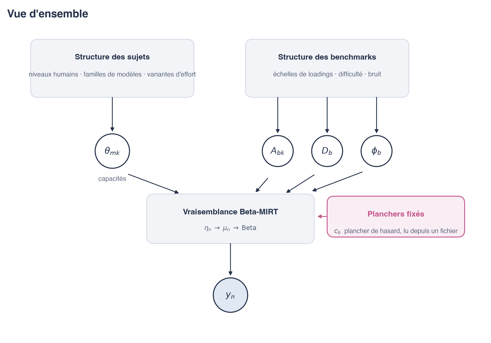
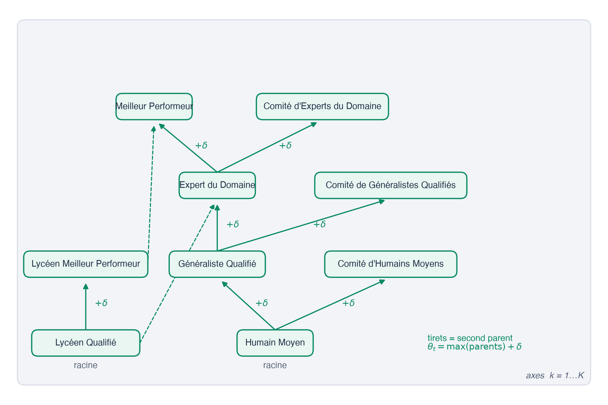
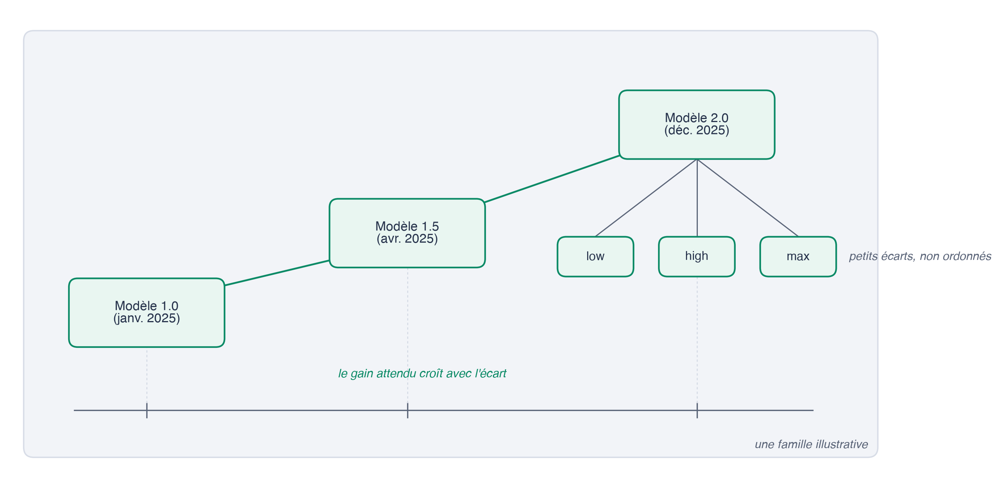
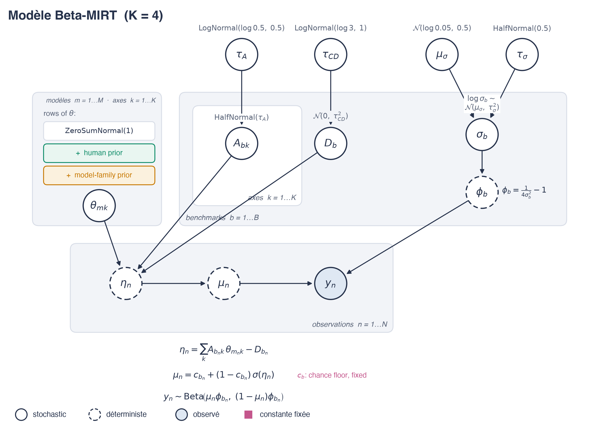
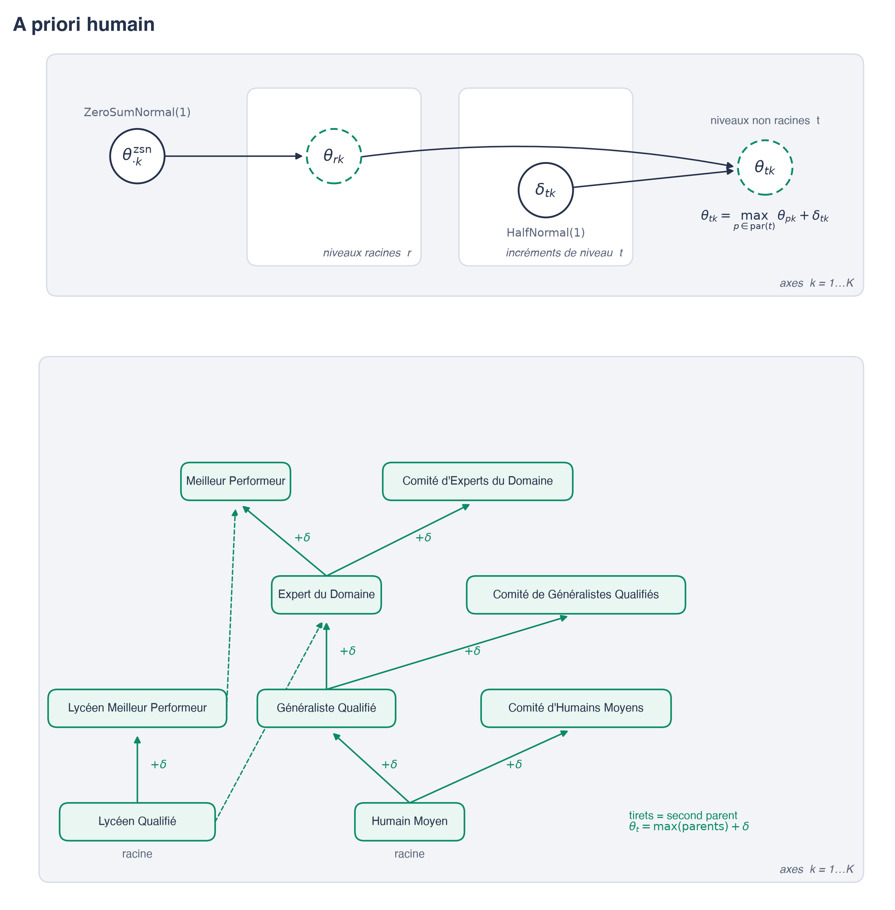
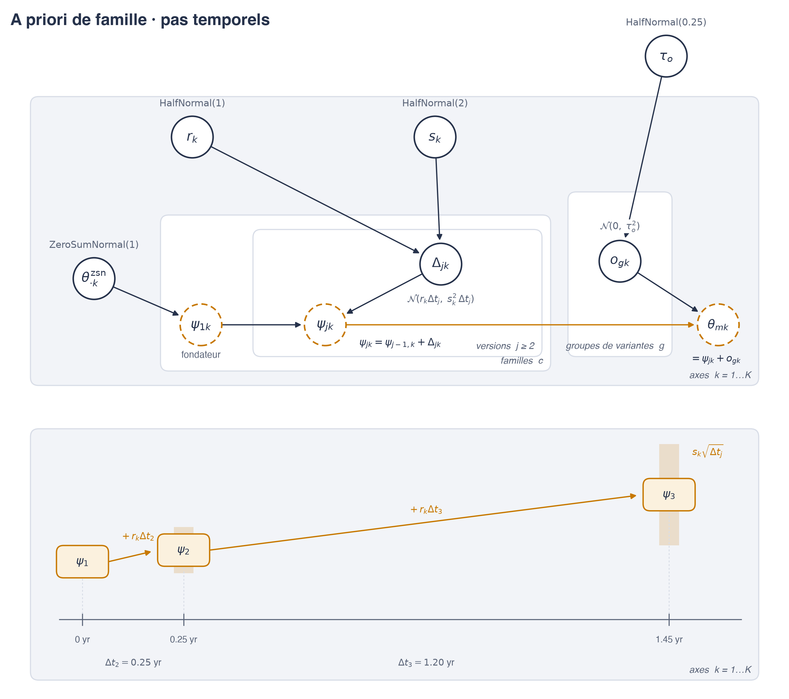

# Quatre axes de capacité pour prévoir les progrès de l'IA face aux niveaux d'expertise humaine

**Une question qui anime nos travaux est de chercher à anticiper quand les modèles d'IA à usage général pourraient devenir meilleurs que les experts humains sur toutes les tâches cognitives.** Le profil de compétences de ces IA étant très hétérogène, nous cherchons en particulier à estimer quand les modèles rattraperont les experts humains dans les domaines où ils sont actuellement le plus en retard.

Dans un [billet précédent](https://gpaipolicylab.org/blog-1), nous avions ajouté des références de performance humaine à l'Epoch Capabilities Index (ECI), une échelle agrégeant les scores de nombreux benchmarks en un score unique par modèle d'IA. L'objectif de ce premier billet était de comparer les capacités des modèles à des niveaux d'expertise humaine afin de pouvoir anticiper leur potentiel dépassement.

Une difficulté persistait toutefois pour la raison suivante :
- d'un côté, la plupart des humains obtiennent des scores quasi parfaits sur certains benchmarks de raisonnement abstrait comme ARC-AGI ou VPCT, mais des scores proches du hasard sur les benchmarks de connaissances scientifiques type GPQA,
- de l'autre, les modèles d'IA de frontière montrent le profil exactement inverse sur ces mêmes benchmarks.

Cette incohérence implique qu'il n'est pas possible de produire ces deux classements à la fois avec un indice unique. **Ce billet lève cette limite en passant à un modèle à quatre axes de compétence au lieu d'un seul**, dans un cadre bayésien permettant une meilleure estimation des incertitudes sur les prévisions qui en découlent. Le code et les données sont disponibles sur [GitHub](https://github.com/General-Purpose-AI-Policy-Lab/Multiaxis_ECI).

## En bref

Nous avons étendu l'Epoch Capabilities Index à quatre axes de compétence, dans un cadre bayésien où chaque capacité estimée est accompagnée de son incertitude et où les niveaux humains sont intégrés au modèle comme des sujets évalués à part entière.

**Résultats principaux :**

- Les quatre axes qui émergent du modèle sont **Intelligence fluide**, **Connaissances et raisonnement scientifiques**, **Agentique** et **Questions-Réponses (saturées)**.
- Les modèles ont désormais dépassé tous les niveaux humains sur l'axe Connaissances et raisonnement scientifiques, ce qui en dit sans doute plus sur l'étendue du rappel de connaissances que sur la capacité à faire de la science.
- Sur les capacités agentiques, la frontière atteint le niveau du Généraliste Qualifié en ce moment même (été 2026).
- Sur l'Intelligence fluide, les modèles ont probablement dépassé l'Humain Moyen, mais les experts humains gardent l'avantage. Si la tendance reste linéaire, elle croisera les niveaux les plus élevés en 2027 et 2028.

Points méthodologiques :
- Les données sont éparses, la matrice sujets × benchmarks n'étant remplie qu'à 6 %. Le modèle ne converge donc pas vers une réponse unique par lui-même, ce que nous avons résolu en ajoutant deux éléments a priori, un ordre strict sur les niveaux humains et une attente souple de progression le long des versions successives d'une même famille de modèles (GPT, Claude).
- Quatre des dix chaînes d'échantillonnage convergent vers un second mode, qui place les niveaux humains un peu différemment et déplace les dates des projections de quelques mois à quelques années.

## Le point de départ, un indice unidimensionnel

Nous partons de la [version bayésienne de l'ECI proposée par Alexander Barry](https://abstatisticalconsulting.substack.com/p/kicking-the-tires-of-the-epoch-capabilities-741), que nous avons reconstruite en Python avec PyMC. Dans ce cadre bayésien, au lieu d'obtenir une seule valeur pour chaque paramètre, des distributions de valeurs plausibles sont échantillonnées, ce qui permet d'estimer l'incertitude autour de chaque capacité estimée.

Nous intégrons aussi les neuf niveaux humains de référence (*baselines*) comme des sujets évalués aux côtés des modèles, de l'Humain Moyen jusqu'aux Comités d'Experts du Domaine, en passant par deux niveaux lycéens. Les références et la table de benchmarks ont été mises à jour et étendues depuis le billet précédent (les tables complètes, avec leurs sources, sont en annexe). Pour ce modèle unidimensionnel uniquement, nous avons exclu les benchmarks faciles pour les humains comme ARC-AGI ou VPCT, comme dans le billet précédent (la liste est en annexe).

Nous appelons l'indice reconstruit **ECI-H**, H pour les références humaines. Nos valeurs diffèrent de celles publiées par Epoch pour trois raisons principales. D'abord, notre ensemble de benchmarks est plus large et écarte huit benchmarks faciles pour les humains (pour cette échelle unidimensionnelle uniquement). Ensuite, Epoch publie une valeur par modèle, en retenant son meilleur score sur chaque benchmark, alors que nous traitons chaque variante d'effort de raisonnement comme un sujet à part entière, avec ses propres scores. Enfin, nous incluons des références humaines dans l'analyse.

Chaque benchmark reçoit également une difficulté sur la même échelle, ce qui permet de représenter ensemble, dans le temps, les modèles, les benchmarks et les niveaux humains.

*Figure 1 - Capacités des IA, niveaux humains et difficulté des benchmarks sur l'échelle ECI-H, avec intervalles à 80 %. Les points verts sont les modèles d'IA à leur date de sortie, les points roses les difficultés des benchmarks. Les lignes en tirets sont les niveaux humains. L'échelle est ancrée à Claude 3.5 Sonnet = 130 et GPT-5 (medium) = 150 pour correspondre à celle d'Epoch.*

Toutefois, placer les IA et les humains sur un axe de compétence unique reste très discutable.

## L'extension multidimensionnelle

Comme évoqué plus haut et discuté dans le billet précédent, certains benchmarks sont triviaux pour les humains et difficiles pour les IA, ce qui brise l'hypothèse d'un axe de difficulté unique. L'analyse d'Epoch AI [« Benchmark Scores = General Capability + Claudiness »](https://epoch.ai/gradient-updates/benchmark-scores-general-capability-claudiness) pointe elle aussi vers des scores portés par plus d'une dimension, et cela sans même que les références humaines ne soient incluses. Nous testons donc cette hypothèse en étendant le modèle à quatre axes de compétence à l'aide d'un modèle dit **MIRT** (*Multidimensional Item Response Theory*), un outil classique de la psychométrie, tout en conservant l'ensemble des benchmarks et les références humaines.

**L'intuition est la suivante. Chaque sujet possède quatre capacités qui forment son profil de compétence, comme un élève peut être fort en algèbre et faible en rédaction, et chaque benchmark pondère les compétences sur lesquelles il repose.** Comme les données seules ne suffisent pas à identifier le modèle mathématique que nous avons construit, deux hypothèses d'ordre sont ajoutées, d'une part un ordre strict sur les niveaux humains et de l'autre une attente d'amélioration le long des versions d'une même famille de modèles d'IA (GPT, Claude). La description détaillée du modèle mathématique et de ces hypothèses est donnée dans la section Méthodologie.

## Résultats

Avec ces hypothèses en place, le modèle mathématique se fixe sur une réponse unique pour la plupart des chaînes d'échantillonnage. Voyons les résultats qui en découlent.

### Les axes

Nous nommons chaque axe d'après les benchmarks dont les vecteurs de pondérations lui sont les plus colinéaires, c'est-à-dire les benchmarks qui sollicitent cette compétence et presque rien d'autre.

- **Axe 1 : Intelligence fluide**, défini par ARC-AGI-2, ARC-AGI et VPCT, des benchmarks de puzzles abstraits.
- **Axe 2 : Connaissances et raisonnement scientifiques**, défini par WMDP Chimie et Biologie, les sous-ensembles scientifiques de GPQA et FrontierMath.
- **Axe 3 : Agentique**, défini par GBAEval, le Remote Labor Index et SWE-Bench Pro, des benchmarks où le modèle mène des tâches longues plutôt que de répondre à des questions.
- **Axe 4 : Questions-Réponses (saturées)**, composé pour l'essentiel d'anciens benchmarks de questions-réponses largement saturés, OpenBookQA, ARC (AI2), BoolQ et similaires.

*Figure 2 - Les 20 benchmarks qui définissent le mieux chaque axe. Les barres représentent les pondérations, ou loadings (médiane, intervalle à 95 %).*

Voici comment les meilleurs modèles se comparent aux humains sur chaque axe.

*Figure 3 - Meilleurs modèles et les neuf niveaux humains sur chaque axe (médiane, intervalle à 95 %, chaînes majoritaires). Les modèles affichés sont ceux retenus pour les projections : capacité bien estimée sur l'axe (écart-type a posteriori inférieur à 0,33) ou modèle de frontière.*

Les modèles de frontière dépassent tous les niveaux humains sur les Connaissances et le raisonnement scientifiques. Sur l'Intelligence fluide, c'est l'inverse. Chaque niveau humain, à l'exception de l'Humain Moyen, se place au-dessus des meilleurs modèles. Sur les Questions-Réponses (saturées), les humains dominent également, mais il s'agit plutôt d'un artefact de données. Les huit benchmarks qui définissent cet axe le plus purement (part d'axe supérieure à un demi) n'ont plus été passés par des modèles depuis mi-2024, la plupart y plafonnant déjà autour de 0,9, et aucun modèle de frontière n'y a jamais été mesuré. L'avance humaine sur cet axe est donc une comparaison avec un bassin figé de modèles anciens, jamais confrontée à la frontière actuelle.

## Projections

Pour ces prévisions, seuls les modèles dont la capacité sur l'axe est bien estimée entrent dans le calcul (écart-type a posteriori inférieur à 0,33, en ajoutant une sélection de modèles de frontière). Nous prenons les meilleurs modèles pour chaque axe de capacité, et construisons une enveloppe des records, de manière à obtenir une frontière de capacité pour chaque tirage de la distribution a posteriori. Nous prolongeons ensuite cette frontière à son rythme mesuré sur une fenêtre d'un an et demi, pour estimer quand elle atteint chaque niveau humain. Comme indiqué plus haut, les positions des modèles récents sur l'axe Questions-Réponses (saturées) ne proviennent pas de capacités mesurées, donc nous excluons cet axe des projections. Les chiffres mis en avant ci-dessous correspondent au mode majoritaire obtenu à partir des données (6 chaînes sur 10, le mode minoritaire étant en annexe).

**Sur l'axe Intelligence fluide, la frontière a probablement dépassé l'Humain Moyen et se situe au niveau du Généraliste Qualifié, mais reste sous les références expertes.** Elle est en passe d'atteindre l'Expert du Domaine d'ici le printemps 2027 et de dépasser le Meilleur Performeur vers mi-2028.

**Sur l'axe Agentique, les modèles ont déjà dépassé une partie des niveaux inférieurs, et la frontière atteint la référence du Généraliste Qualifié** (nous écrivons ces lignes fin août 2026). Elle devrait dépasser le Comité d'Experts du Domaine vers mi-2027.

**Sur l'axe Connaissances et raisonnement scientifiques, les modèles ont déjà dépassé tous les niveaux humains**, avec des niveaux de certitude de 85 % à 95 %. Les données brutes confirment par exemple que sur WMDP Chimie, la référence Expert du Domaine est à 0,433 contre 0,809 pour le meilleur modèle. Sur WMDP Biologie, l'écart est de 0,605 contre 0,875, et sur GPQA Diamond de 0,812 contre 0,946. La référence Généraliste Qualifié se place sous le niveau du hasard sur GPQA Diamond, à 0,22, et même le doctorant du domaine n'obtient que 0,43 sur WMDP Chimie. De fait, chaque modèle sur cet axe se place au-dessus des références humaines depuis 2023. En pratique, ces résultats en disent toutefois davantage sur ce que ces benchmarks récompensent, c'est-à-dire l'étendue des connaissances à travers toute une discipline, que sur la capacité actuelle des modèles d'IA à faire de la recherche scientifique à un niveau expert.

*Figure 4 - Tendance de la frontière par axe (chaînes majoritaires). Les points sont les modèles datés, la courbe orange est l'enveloppe des records prolongée à son rythme récent, avec sa bande à 80 %. Les lignes en tirets sont les niveaux humains de référence.*

*Figure 5 - Dates auxquelles la tendance extrapolée atteint chaque niveau humain (médiane, intervalles à 50 % et 80 %, chaînes majoritaires). « Aujourd'hui » correspond au 1er septembre 2026.*

L'hypothèse principale de ces projections est que la tendance prolongée au rythme récent conserve sa pente. Cette hypothèse apparaît raisonnable dans notre fenêtre d'observation, où la frontière ne montre aucun signe de décélération et semble même accélérer sur l'axe Agentique avec les dernières sorties. Ces dates doivent être lues avec l'incertitude que le modèle leur attache. Sur l'intervalle d'incertitude à 95 %, les fenêtres de croisement s'étirent de plusieurs années supplémentaires. Le meilleur moyen de resserrer ces estimations serait d'obtenir de meilleures références humaines, en particulier sur l'axe Agentique où les niveaux humains reposent sur une poignée de mesures.

## Méthodologie

### Le modèle

Chaque sujet *m* possède quatre capacités qui forment son profil de compétence. Chaque benchmark *b* pondère ces compétences via quatre pondérations positives (*loadings*), une par axe, qui représentent à quel point chaque compétence compte pour ce benchmark. Les pondérations règlent aussi dans quelle mesure un benchmark est capable de séparer les sujets passant les tests, ce que la littérature psychométrique appelle la discrimination. Un benchmark fortement pondéré distingue bien les modèles faibles des modèles forts, alors qu'un benchmark aux pondérations faibles sépare moins bien différents niveaux de compétence. La difficulté *D* est la barre que la somme pondérée des compétences doit franchir pour dépasser le score médian sur un benchmark donné. À la fin une courbe sigmoïde transforme le résultat en un score entre 0 et 1. Enfin, nous intégrons la possibilité de bonnes réponses au hasard en fixant à l'avance le plancher de chance de chaque benchmark, de sorte qu'un QCM à quatre options a un score plancher de 0,25 et non de 0.

Le score attendu du sujet *m* sur le benchmark *b* s'écrit ainsi

$$\mu = c_b + (1 - c_b)\,\sigma\!\Big(\sum_{k=1}^{4} A_{b,k}\,\theta_{m,k} - D_b\Big)$$

et le score observé fluctue autour de cette valeur avec un bruit Beta (à la suite du billet de Barry), chaque benchmark ayant son propre niveau de bruit.

La forme retenue à l'intérieur de la sigmoïde appartient à l'une des trois familles usuelles de la littérature IRT. Elle est dite **compensatoire**, parce qu'une compétence forte peut y compenser une compétence faible à l'intérieur de la somme. Dans la famille non compensatoire, un benchmark exige toutes ses compétences à la fois et la somme devient un produit de courbes par axe. La famille semi-compensatoire se situe entre les deux et ajoute des termes d'interaction à la somme compensatoire. Nous avons essayé les deux alternatives. L'ajustement non compensatoire n'a pas convergé, et le semi-compensatoire n'a convergé que sous de fortes contraintes, et a produit de moins bonnes prédictions.

*Figure 6 - Le modèle sous forme de graphe.*

### Les hypothèses a priori

Nous avons d'abord tenté d'ajuster ce modèle sans autre hypothèse que celles décrites ci-dessus, mais il ne se fixait pas sur une réponse unique. En cause, la rareté des données (la matrice sujets × benchmarks n'est remplie qu'à 6 %, et le sujet moyen ne compte qu'environ six scores) et le fait que de nombreux arrangements de capacités et de pondérations expliquent les scores aussi bien les uns que les autres. Des chaînes d'échantillonnage parallèles convergeaient donc vers des solutions différentes, et nous avons choisi d'injecter davantage d'information a priori dans le modèle mathématique pour l'aider à converger vers une réponse unique.

#### L'ordre humain (a priori strict)

Dans les données, les humains non spécialistes ont surtout été évalués sur des benchmarks qui leur sont faciles, tandis que les experts l'ont surtout été sur des benchmarks difficiles. Or, nous savons a priori qu'un humain moyen ferait moins bien qu'un expert sur les benchmarks difficiles, et qu'un expert ferait au moins aussi bien qu'un humain moyen sur les benchmarks faciles. Ces connaissances permettent de fournir au modèle un ordre a priori. Un Expert du Domaine y est au moins aussi bon qu'un Généraliste Qualifié, et un Comité au moins aussi bon que chacun de ses membres, sur chaque compétence. L'ordre ne dit rien de la taille des écarts entre niveaux. Là où aucun classement ne s'impose, par exemple entre un Meilleur Performeur et un Comité d'Experts, nous n'imposons rien. Les deux niveaux Lycéens rejoignent l'ordre par deux liens, l'Expert du Domaine étant au moins aussi bon que le Lycéen Qualifié et le Meilleur Performeur au moins aussi bon que le Lycéen Meilleur Performeur.

*Figure 7 - L'ordre a priori des niveaux humains.*

#### Les familles de modèles (a priori souple)

Les modèles récents manquent parfois de données pour estimer leurs capacités, mais au sein d'une même lignée, les GPT successifs ou la série Claude Opus par exemple, on peut s'attendre à ce que chaque nouvelle version améliore la précédente. Une version peut toutefois régresser si les données le justifient. Nous ne faisons que l'encourager doucement vers l'amélioration. Nous utilisons le temps écoulé entre deux sorties pour calibrer l'écart attendu, de sorte que le gain espéré croît avec l'intervalle, et une entreprise qui publie beaucoup de petites mises à jour n'est pas supposée progresser plus vite qu'une autre qui publie une seule grosse version sur la même année. Quant aux variantes d'effort de raisonnement, elles sont rattachées à leur version de base et nous ne les ordonnons pas entre elles, un effort plus élevé pouvant conduire le modèle à trop réfléchir et dégrader ses performances.

*Figure 8 - Un exemple illustratif de chaîne de versions au sein d'une famille.*

On peut comparer les variantes de modélisation pour mesurer ce que ces a priori apportent. Sans aucun a priori, les résultats se séparent en deux systèmes d'axes différents. Avec l'ordre humain seul, il reste deux solutions en désaccord sur les axes. C'est l'ajout de l'hypothèse de famille qui met enfin toutes les chaînes d'échantillonnage d'accord sur un même système d'axes. Nous avons aussi essayé trois axes avec toutes les hypothèses activées, et les chaînes se séparent encore en deux groupes de résultats possibles. Ces hypothèses améliorent par ailleurs la capacité prédictive du modèle. Sur une validation croisée, dite *leave-one-out*, le modèle final bat la version sans a priori d'environ 107 ± 18 points et l'indice unidimensionnel d'environ 1 000 ± 33, en comparant sur les lignes où la comparaison est fiable.

## Limites

La première limite tient aux données elles-mêmes. Comme expliqué dans le billet précédent, il en faut davantage et de meilleure qualité, pour les références humaines d'abord, mais aussi pour les modèles. Nous ne remplissons que 6 % de la matrice sujets × benchmarks, et cette rareté nous a contraints à ajouter des hypothèses au modèle.

La deuxième, que nous partageons avec l'article Rosetta Stone et l'ECI en général, est que nous ajustons des scores agrégés par benchmark plutôt que des réponses question par question. Les hypothèses du cadre MIRT ne sont donc pas pleinement respectées.

La dernière concerne la calibration. Nos intervalles prédictifs sont plus larges que ce que les données exigent, ce qui rend le modèle plus prudent qu'il ne devrait l'être.

## Pistes de travail

Au-delà de la collecte de données supplémentaires, quelques directions valent la peine d'être explorées.

- **Faire passer les benchmarks saturés aux modèles de frontière actuels.** Cela permettrait de trancher l'axe Questions-Réponses (saturées) avec des données plutôt que de le laisser à l'état d'artefact, tout en remplissant la grille des données.
- **Des plafonds sur les benchmarks saturés.** Nous fixons déjà un plancher de hasard par benchmark. Un plafond, inféré des données ou fixé, permettrait de lire la saturation comme telle et non comme une difficulté extrême.
- **Tester les projections dans les deux sens.** Ajuster le modèle sur un sous-échantillon plus ancien des données et confronter ses prévisions aux sorties advenues depuis.

## Annexes

### Annexe A. Spécification graphique du modèle

*Figure 9 - La représentation graphique complète du modèle.*

*Figure 10 - La représentation graphique de l'a priori humain.*

*Figure 11 - La représentation graphique de l'a priori côté modèles.*

### Annexe B. Les ajustements précédents

Cette annexe consigne les ajustements précédents et l'effet de chaque hypothèse sur le modèle. Pour le modèle unidimensionnel, nous utilisons tous les benchmarks afin de le comparer à l'ajustement final.

| Ajustement | Runs × tirages | Divergences | Modes a posteriori (systèmes d'axes) | elpd (LOO) ± es | Δ vs final (a) |
|---|---|---|---|---|---|
| Indice 1D | 10 × 10 000 | 0 | 1 | 6 249,6 ± 112,1 | −999,6 ± 33,2 |
| 4 axes, sans a priori | 12 × 3 000 | 778 | 2 | 7 583,9 ± 75,9 | −107,2 ± 18,3 |
| 4 axes, ordre humain seul | 12 × 3 000 | 80 | 2 | 7 583,3 ± 73,1 | −109,2 ± 17,2 |
| 4 axes, les deux a priori (final) | 10 × 12 000 | 37 (b) | 1 (c) | 7 710,4 ± 76,3 | 0 |
| 3 axes, les deux a priori | 12 × 3 000 | 12 | 2 (d) | 7 447,8 ± 77,4 | −191,1 ± 14,3 |

(a) Les écarts LOO appariés n'utilisent que les lignes dont le Pareto-k est inférieur à 0,7 dans les deux ajustements.
(b) Ces divergences sont mineures et ne concernent qu'un paramètre associé au benchmark GSM8K.
(c) Les deux groupes d'exécutions du modèle final partagent un même système d'axes et ne diffèrent que sur les niveaux humains et 18 modèles anciens ou peu évalués de l'axe Agentique (Annexe C), contrairement aux autres ajustements, qui ne s'accordent pas sur les axes.
(d) À trois axes, avec toutes les hypothèses, dix exécutions se séparent contre deux, en échangeant deux des axes entre les solutions.

### Annexe C. Le mode minoritaire

Quatre des dix chaînes d'échantillonnage placent les niveaux humains différemment. Cette annexe consigne ce qui bouge et comment les prévisions changent.

L'écart entre le mode minoritaire et le mode majoritaire, moyenné sur les neuf niveaux, s'établit à +0,71 sur l'Intelligence fluide, −0,04 sur les Connaissances et le raisonnement scientifiques, −2,71 sur l'Agentique et +1,58 sur les Questions-Réponses (saturées). Les deux groupes partagent un même système d'axes et décrivent les scores aussi bien l'un que l'autre.

*Figure 12 - Les niveaux humains, les six chaînes majoritaires (bleu) face aux quatre autres (orange).*

*Figure 13 - Les 18 modèles que les deux groupes échantillonnés placent différemment, tous sur l'axe Agentique.*

Voici les projections pour les chaînes minoritaires.

*Figure 14 - Dates auxquelles la tendance extrapolée atteint chaque niveau humain pour les chaînes minoritaires (médiane, intervalles à 50 % et 80 %). « Aujourd'hui » correspond au 1er septembre 2026.*

Dans ces prévisions minoritaires, sur l'axe Agentique, tous les niveaux humains seront bientôt dépassés. Sur l'Intelligence fluide, les modèles de frontière restent au contraire sous l'Humain Moyen, contrairement à ce que prédisent les chaînes majoritaires.

### Annexe D. Les intervalles à 95 %

Voici les dates de croisement avec les intervalles à 95 %, pour les chaînes majoritaires et minoritaires.

*Figure 15 - Dates auxquelles la tendance extrapolée atteint chaque niveau humain pour les chaînes majoritaires (médiane, intervalle à 95 %). « Aujourd'hui » correspond au 1er septembre 2026.*

*Figure 16 - Dates auxquelles la tendance extrapolée atteint chaque niveau humain pour les chaînes minoritaires (médiane, intervalle à 95 %). « Aujourd'hui » correspond au 1er septembre 2026.*

Pour les chaînes majoritaires, les fenêtres à 95 % sont nettement plus larges sur tous les axes, mais se referment au plus tard vers 2035. Pour les chaînes minoritaires, seul l'axe Intelligence fluide garde des intervalles à 95 % relativement resserrés ; partout ailleurs, les incertitudes deviennent très importantes.

### Annexe E. Calibration (PIT)

Pour chaque score observé, nous calculons où il tombe dans la distribution prédictive du modèle (la transformation intégrale de probabilité, PIT). Un modèle parfaitement calibré répartirait ces valeurs uniformément. Notre histogramme bombe au centre, les scores observés tombant près du centre des intervalles prédictifs plus souvent qu'ils ne le devraient. Les intervalles sont donc plus larges que nécessaire, et le modèle plutôt conservateur.

*Figure 17 - PIT de l'ajustement final. Un modèle calibré est plat, à densité 1.*

### Annexe F. Références humaines et liste des benchmarks

Les scores humains utilisés, avec leurs sources, ainsi que la liste exhaustive des benchmarks inclus dans le modèle, sont donnés dans la version anglaise du billet. *(Tables identiques. Les huit benchmarks exclus du modèle unidimensionnel y sont également listés.)*
