# Quatre axes de capacité pour situer l'IA face aux niveaux d'expertise humaine

*Billet de recherche — GPAI Policy Lab*

L'Epoch Capabilities Index (ECI) compresse les scores de nombreux benchmarks en un
score unique par modèle d'IA, selon le cadre proposé par l'article « A Rosetta Stone
for AI Benchmarks ». Dans un [billet précédent](https://gpaipolicylab.org/blog-1),
nous avions ajouté des références de performance humaine à cette échelle, pour situer
les modèles par rapport à des niveaux d'expertise concrets. Une difficulté était
restée entière : la plupart des humains obtiennent des scores quasi parfaits sur les
benchmarks de raisonnement abstrait comme ARC-AGI ou VPCT, et des scores proches du
hasard sur les benchmarks de type GPQA, tandis que de nombreux modèles montrent le
profil inverse. Un indice unique ne peut pas produire ces deux classements à la fois.
Ce billet lève cette limite en passant à un modèle bayésien à **quatre axes de
compétence** au lieu d'un seul, avec une estimation propre des incertitudes.

## En bref

Nous avons étendu l'Epoch Capabilities Index à quatre axes de compétence, dans un
cadre bayésien où chaque capacité estimée est accompagnée de son incertitude et où
les niveaux humains sont intégrés au modèle comme des sujets évalués à part entière.

Les données sont éparses : la matrice sujets × benchmarks n'est remplie qu'à 6 %.
Le modèle ne converge donc pas vers une réponse unique par lui-même, et il faut deux
a priori d'ordre pour l'identifier : un ordre strict sur les niveaux humains, et une
amélioration attendue, souple, le long des versions successives d'une même famille de
modèles.

**Résultats principaux :**

- Les quatre axes qui émergent du modèle sont **Intelligence fluide**,
  **Connaissances et raisonnement scientifiques**, **Agentique** et **QA
  historiques**.
- Les modèles ont désormais dépassé tous les niveaux humains sur l'axe Connaissances
  et raisonnement scientifiques — ce qui en dit sans doute plus sur l'étendue du
  rappel de connaissances que sur la capacité à faire de la science.
- Sur les capacités agentiques, la frontière atteint le niveau du Généraliste
  qualifié en ce moment même (été 2026).
- Sur l'Intelligence fluide, les modèles ont probablement dépassé l'Humain moyen,
  mais les experts humains gardent l'avantage. Si la tendance reste linéaire, elle
  croisera les niveaux les plus élevés en 2027 et 2028.
- Quatre des dix chaînes d'échantillonnage convergent vers un second mode, qui place
  les niveaux humains un peu différemment et déplace ces dates de quelques mois à
  quelques années.

## Le point de départ : l'indice unidimensionnel

Nous partons de la [version bayésienne de l'ECI proposée par Alexander
Barry](https://www.lesswrong.com/posts/) et nous l'avons reconstruite en Python avec
PyMC. Dans ce cadre bayésien, au lieu de chercher une seule valeur optimale pour
chaque paramètre, on échantillonne toute une distribution de valeurs plausibles :
chaque capacité estimée vient avec son incertitude. La spécification complète du
modèle est donnée plus bas.

Nous intégrons aussi les neuf niveaux humains comme des sujets évalués aux côtés des
modèles, de l'Humain moyen jusqu'aux Comités d'experts du domaine, en passant par
deux niveaux lycéens. Les références et la table de benchmarks ont été mises à jour
et étendues depuis le billet précédent (les tables complètes, avec leurs sources,
sont en annexe). Pour ce modèle unidimensionnel uniquement, nous avons exclu les
benchmarks faciles pour les humains comme ARC-AGI ou VPCT, comme dans le billet
précédent (la liste est en annexe).

Voici notre indice reconstruit — que nous appelons **ECI-H**, H pour les références
humaines (*human baselines*) — confronté aux scores ECI publiés par Epoch pour les
modèles de pointe :

<!-- TODO Figure 1 : comparaison ECI-H vs ECI publié par Epoch — le script de cette
figure n'est pas dans ce dépôt ; insérer le rendu (FR si disponible). -->
*Figure 1 - Modèles de pointe : notre ECI-H (intervalle à 90 %) face aux valeurs
publiées par Epoch (intervalles publiés le cas échéant). Epoch publie une valeur par
modèle, répétée ici pour chacune de ses variantes d'effort de raisonnement.*

Nos valeurs diffèrent de celles d'Epoch pour trois raisons principales. D'abord, nous
n'ajustons pas la même table : notre ensemble de benchmarks est plus large et écarte
huit benchmarks faciles pour les humains. Ensuite, Epoch publie une valeur par
modèle, en retenant son meilleur score sur chaque benchmark, alors que nous traitons
chaque variante d'effort de raisonnement comme un sujet à part entière, avec ses
propres scores. Enfin, nous incluons les références humaines.

Chaque benchmark reçoit également une difficulté sur la même échelle, ce qui permet
de représenter ensemble, dans le temps, les modèles, les benchmarks et les niveaux
humains :

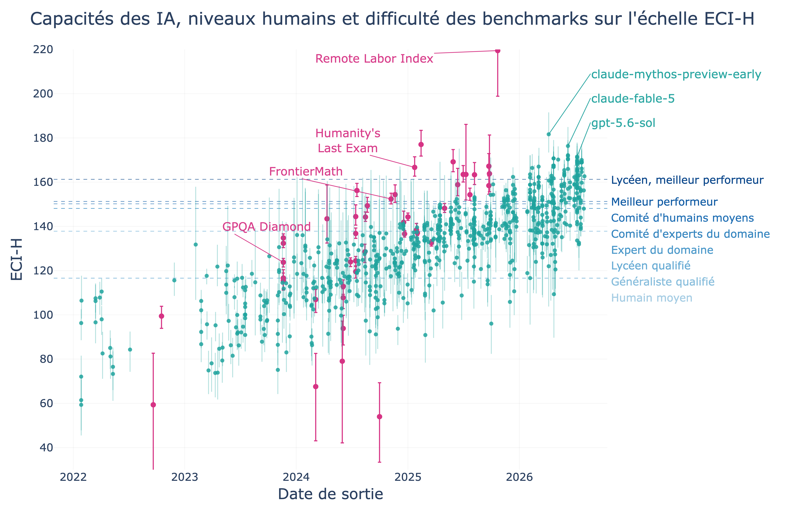
*Figure 2 - Capacités des IA, niveaux humains et difficulté des benchmarks sur
l'échelle ECI-H, avec intervalles à 80 %. Les points verts sont les modèles d'IA à
leur date de sortie, les points roses les difficultés des benchmarks. Les lignes en
tirets sont les niveaux humains. L'échelle est ancrée à Claude 3.5 Sonnet = 130 et
GPT-5 (medium) = 150 pour correspondre à celle d'Epoch.*

## L'extension multidimensionnelle

Comme évoqué plus haut et discuté dans le billet précédent, certains benchmarks sont
triviaux pour les humains et difficiles pour les IA, ce qui brise l'hypothèse d'un
axe de difficulté unique. L'analyse d'Epoch [« Benchmark Scores = General Capability
+ Claudiness »](https://epoch.ai/) pointe elle aussi vers des scores portés par plus
d'une dimension — et cela entre modèles seulement. Nous testons cette hypothèse en
étendant le modèle à quatre axes de compétence à l'aide d'un modèle **MIRT**
(*Multidimensional Item Response Theory*), un outil classique de la psychométrie, en
conservant l'ensemble des benchmarks et les références humaines.

L'intuition du modèle est la suivante : chaque sujet possède quatre capacités qui
forment son profil de compétence, comme un élève peut être fort en algèbre et faible
en rédaction. Chaque benchmark pondère ces compétences à travers quatre *loadings*
positifs (ses saturations factorielles), un par axe, qui disent combien chaque
compétence compte pour ce benchmark. Les loadings règlent aussi la finesse avec
laquelle un benchmark sépare ses sujets — ce que la littérature psychométrique
appelle la discrimination : un benchmark aux loadings élevés distingue nettement les
modèles faibles des modèles forts, un benchmark aux loadings faibles ne réagit guère
à la compétence. La difficulté est la barre que la somme pondérée des compétences
doit franchir pour dépasser le score médian, et une courbe en S transforme le
résultat en un score entre 0 et 1. Il faut enfin tenir compte du hasard : nous fixons
à l'avance le plancher de chance de chaque benchmark et faisons démarrer la courbe à
ce plancher plutôt qu'à 0, de sorte qu'un QCM à quatre options a un score plancher de
0,25 et non de 0.

Le score attendu du sujet *m* sur le benchmark *b* s'écrit ainsi

$$\mu = c_b + (1 - c_b)\,\sigma\!\Big(\sum_{k=1}^{4} A_{b,k}\,\theta_{m,k} - D_b\Big)$$

et le score observé fluctue autour de cette valeur avec un bruit Beta (à la suite du
billet de Barry), chaque benchmark ayant son propre niveau de bruit.

La forme retenue à l'intérieur de la sigmoïde appartient à l'une des trois familles
usuelles de la littérature IRT ; on la dit **compensatoire**, parce qu'une compétence
forte peut y compenser une compétence faible à l'intérieur de la somme. Dans la
famille non compensatoire, un benchmark exige toutes ses compétences à la fois et la
somme devient un produit de courbes par axe. La famille semi-compensatoire se situe
entre les deux et ajoute des termes d'interaction à la somme compensatoire. Nous
avons essayé les deux alternatives : l'ajustement non compensatoire n'a pas convergé,
et le semi-compensatoire n'a convergé que sous de fortes contraintes, avec de moins
bonnes prédictions.

<!-- TODO Figure 3 : le graphe du modèle (page du prior_graph, en anglais —
figures/old/prior_graph-*.png ; choisir la bonne page ou régénérer en FR). -->
*Figure 3 - Le modèle sous forme de graphe.*

## Les hypothèses a priori

Nous avons d'abord tenté d'ajuster ce modèle sans autre hypothèse que celles décrites
ci-dessus, mais il ne se fixait pas sur une réponse unique. En cause, la rareté des
données (la matrice sujets × benchmarks n'est remplie qu'à 6 %, et le sujet moyen ne
compte qu'environ six scores) et le fait que de nombreux arrangements de capacités et
de loadings expliquent les scores aussi bien les uns que les autres : des exécutions
répétées retombaient sur des solutions différentes. Il a donc fallu injecter dans le
modèle davantage d'information a priori pour qu'il converge vers une réponse unique.

### L'ordre humain (a priori strict)

Dans les données, les humains non spécialistes sont surtout évalués sur des
benchmarks qui leur sont faciles, et les experts surtout sur des benchmarks
difficiles. Nous savons pourtant qu'un humain moyen ferait moins bien qu'un expert
sur les benchmarks difficiles, et qu'un expert ferait au moins aussi bien qu'un
humain moyen sur les benchmarks faciles. Nous avons donc donné au modèle un ordre a
priori : un Expert du domaine est au moins aussi bon qu'un Généraliste qualifié, et
un comité au moins aussi bon que chacun de ses membres, sur chaque compétence.
L'ordre ne dit rien de la taille des écarts entre niveaux, et là où aucun classement
ne s'impose — entre un Meilleur performeur et un comité d'experts, par exemple —
nous n'imposons rien. Les deux niveaux lycéens rejoignent l'ordre par deux liens :
l'Expert du domaine est au moins aussi bon que le Lycéen qualifié, et le Meilleur
performeur au moins aussi bon que le Lycéen meilleur performeur.

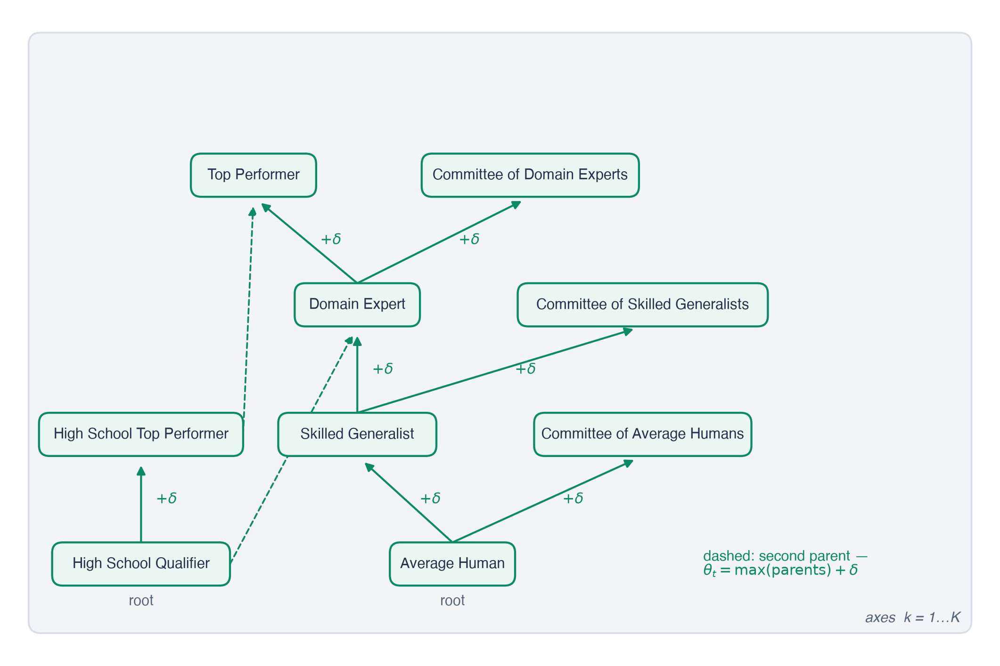
*Figure 4 - L'ordre a priori des niveaux humains (diagramme en anglais).*

### Les familles de modèles (a priori souple)

Les modèles récents manquent parfois de données pour estimer leurs capacités, mais au
sein d'une même lignée — les GPT successifs, la série Claude Opus — on peut
s'attendre à ce que chaque nouvelle version améliore la précédente. Une version peut
régresser si les données le disent ; nous ne faisons que la pousser doucement vers
l'amélioration. Nous utilisons aussi le temps écoulé entre deux sorties pour calibrer
l'écart attendu : le gain espéré croît avec l'intervalle, et un laboratoire qui
publie beaucoup de petites mises à jour n'est pas supposé gagner plus qu'un autre qui
publie une seule grosse version sur la même année. Quant aux variantes d'effort de
raisonnement, elles sont rattachées à leur version de base et nous ne les ordonnons
pas entre elles, un effort plus élevé pouvant conduire le modèle à trop réfléchir.

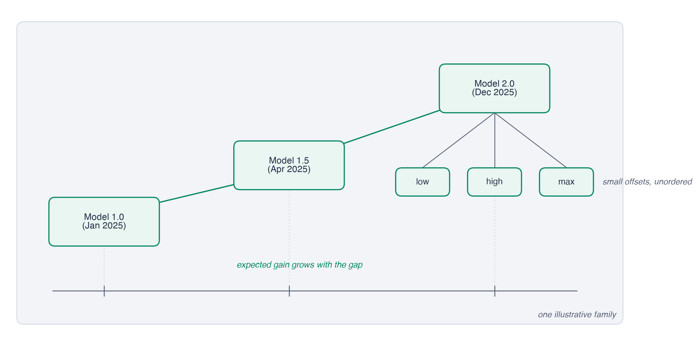
*Figure 5 - Un exemple illustratif de chaîne de versions au sein d'une famille
(diagramme en anglais).*

Pour mesurer ce que ces a priori apportent, on peut comparer les exécutions. Sans
aucun a priori, elles se séparent en deux systèmes d'axes différents. Avec l'ordre
humain seul, il reste deux solutions en désaccord sur les axes. C'est l'ajout de
l'hypothèse de famille qui met enfin toutes les exécutions d'accord sur un même
système d'axes. Nous avons aussi essayé trois axes avec toutes les hypothèses
activées : les exécutions se séparent encore en deux. Ces hypothèses améliorent par
ailleurs la capacité prédictive du modèle : sur des scores mis de côté (validation
croisée *leave-one-out*), le modèle final bat la version sans a priori d'environ
107 ± 18 points et l'indice unidimensionnel d'environ 1 000 ± 33, en comparant sur
les lignes où la comparaison est fiable.

## Résultats

Avec toutes les hypothèses ci-dessus en place, le modèle se fixe sur une réponse
unique pour la plupart des exécutions. Voyons ce qu'il a trouvé.

### Les axes

Nous nommons chaque axe d'après les benchmarks dont les vecteurs de loadings lui sont
les plus colinéaires, c'est-à-dire les benchmarks qui sollicitent cette compétence et
presque rien d'autre :

- **Axe 1 — Intelligence fluide**, défini par ARC-AGI-2, ARC-AGI et VPCT, des
  benchmarks de puzzles abstraits.
- **Axe 2 — Connaissances et raisonnement scientifiques**, défini par WMDP Chimie et
  Biologie, les sous-ensembles scientifiques de GPQA et FrontierMath.
- **Axe 3 — Agentique**, défini par GBAEval, le Remote Labor Index et SWE-Bench Pro,
  des benchmarks où le modèle mène des tâches longues plutôt que de répondre à des
  questions.
- **Axe 4 — QA historiques**, composé pour l'essentiel d'anciens benchmarks de
  questions-réponses largement saturés : OpenBookQA, ARC (AI2), BoolQ et similaires.

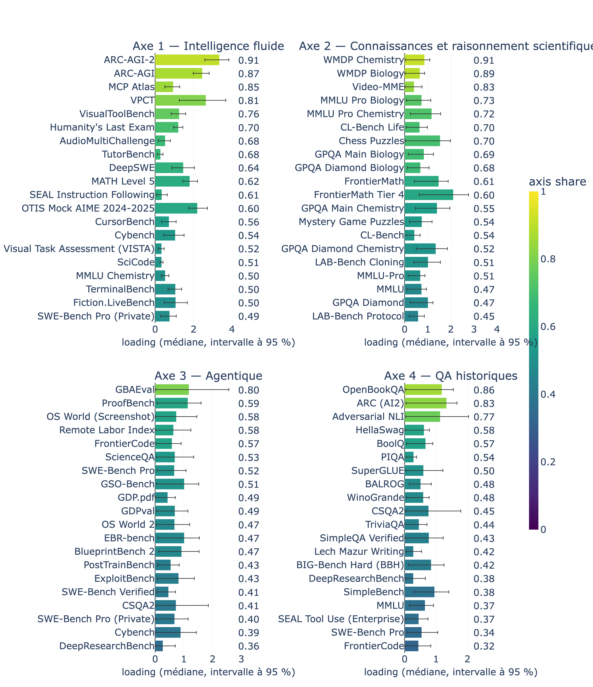
*Figure 6 - Les 20 benchmarks qui définissent le mieux chaque axe. Les barres
représentent les loadings (médiane, intervalle à 95 %).*

Et voici comment les meilleurs modèles se comparent aux humains sur chaque axe :

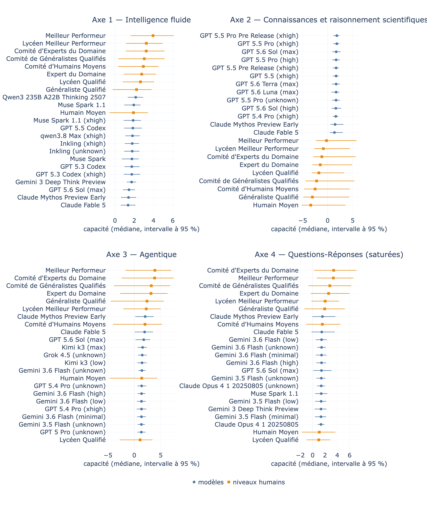
*Figure 7 - Meilleurs modèles et les neuf niveaux humains sur chaque axe (médiane,
intervalle à 95 %).*

Les modèles de frontière dépassent tous les niveaux humains sur les Connaissances et
le raisonnement scientifiques. Sur l'Intelligence fluide, c'est l'inverse : chaque
niveau humain, à l'exception de l'Humain moyen, se place au-dessus des meilleurs
modèles. Sur les QA historiques, les humains dominent également, mais il s'agit
plutôt d'un artefact de données : les huit benchmarks qui définissent cet axe le plus
purement (part d'axe supérieure à un demi) n'ont plus été passés par des modèles
depuis mi-2024, la plupart y plafonnant déjà autour de 0,9, et aucun modèle de
frontière n'y a jamais été mesuré. L'avance humaine sur cet axe est donc une
comparaison avec un bassin figé de modèles anciens, jamais confrontée à la frontière
actuelle.

## Prévisions

Pour ces prévisions, seuls les modèles dont la capacité sur l'axe est bien estimée
entrent dans le calcul (écart-type a posteriori inférieur à 0,33, plus les sorties
frontière signalées). Nous prenons les modèles détenteurs du record pour chaque
jeu plausible de capacités produit par le modèle, construisons une **enveloppe des
records** par tirage (le maximum courant de la frontière dans chaque tirage du
posterior), et nous la prolongeons à son rythme mesuré sur une fenêtre de 1,5 an,
pour voir quand elle atteint chaque niveau humain. Comme indiqué plus haut, les
positions des modèles récents sur l'axe QA historiques proviennent de l'a priori
plutôt que de capacités mesurées : nous laissons cet axe hors des prévisions. Les
chiffres mis en avant ci-dessous correspondent au mode majoritaire (6 exécutions sur
10 ; le mode minoritaire est en annexe).

Sur l'axe **Intelligence fluide**, la frontière a probablement dépassé l'Humain
moyen et se situe au niveau du Généraliste qualifié, mais reste sous les références
expertes. Elle est en passe d'atteindre l'Expert du domaine d'ici le printemps 2027
et de dépasser le Meilleur performeur vers mi-2028.

Sur l'axe **Agentique**, les modèles ont déjà dépassé une partie des niveaux
inférieurs, la frontière atteint la référence du Généraliste qualifié en ce moment
même (nous écrivons ces lignes fin août 2026), et devrait dépasser le Comité
d'experts du domaine vers mi-2027.

Sur l'axe **Connaissances et raisonnement scientifiques**, les modèles ont déjà
dépassé tous les niveaux humains, avec des probabilités de 0,85 à 0,95 (sur WMDP
Chimie, la référence Expert du domaine est à 0,433 contre 0,809 pour le meilleur
modèle ; sur WMDP Biologie, 0,605 contre 0,875 ; sur GPQA Diamond, 0,812 contre
0,946). De fait, chaque modèle sur cet axe se place au-dessus des références humaines
depuis 2023 — ce qui en dit plus sur ce que ces benchmarks récompensent, l'étendue du
rappel de connaissances à travers tout un champ, que sur la capacité à faire de la
science (le Généraliste qualifié est sous le niveau du hasard sur GPQA Diamond, à
0,22, et même le doctorant du domaine n'obtient que 0,43 sur WMDP Chimie).

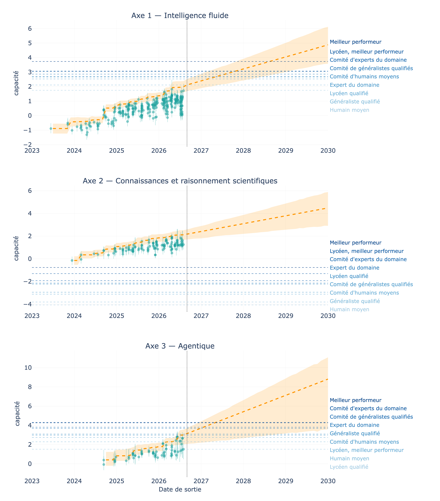
*Figure 8 - Tendance de la frontière par axe (chaînes majoritaires). Les points sont
les modèles datés, la ligne en tirets est l'enveloppe des records prolongée à son
rythme récent, avec sa bande à 80 %. Les lignes fines en tirets sont les niveaux
humains.*

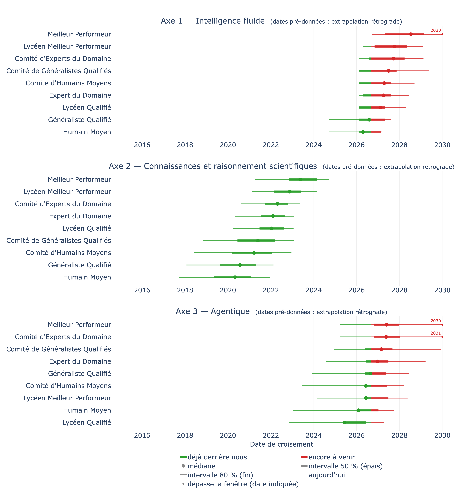
*Figure 9 - Dates auxquelles la tendance extrapolée atteint chaque niveau humain
(médiane, intervalles à 50 % et 80 %, chaînes majoritaires). « Aujourd'hui »
correspond au 1er septembre 2026.*

L'hypothèse principale est ici que la tendance prolongée au rythme récent conserve sa
pente — hypothèse raisonnable dans notre fenêtre d'observation, où la frontière ne
montre aucun signe de décélération et semble même accélérer sur l'axe Agentique avec
les dernières sorties. Ces dates doivent être lues avec l'incertitude que le modèle
leur attache (à 95 %, les fenêtres de croisement s'étirent de plusieurs années
supplémentaires, et bien davantage sur l'axe Agentique), et le meilleur moyen de les
resserrer serait de meilleures références humaines, en particulier sur l'axe
Agentique où les niveaux humains reposent sur une poignée de mesures.

## Limites

La première limite tient aux données elles-mêmes. Comme expliqué dans le billet
précédent, il en faut davantage et de meilleure qualité, pour les références humaines
d'abord, mais aussi pour les modèles : nous ne remplissons que 6 % de la matrice
sujets × benchmarks, et cette rareté nous a contraints à ajouter des hypothèses au
modèle.

La deuxième, que nous partageons avec l'article Rosetta Stone et l'ECI en général,
est que nous ajustons des scores agrégés par benchmark plutôt que des réponses
question par question : les hypothèses du cadre MIRT ne sont donc pas pleinement
respectées.

La dernière concerne la calibration : nos intervalles prédictifs sont plus larges que
ce que les données exigent, ce qui rend le modèle plus prudent qu'il ne devrait
l'être.

## Pistes de travail

Au-delà de la collecte de données supplémentaires, quelques directions valent la
peine d'être explorées :

- **Faire passer les benchmarks historiques aux modèles de frontière actuels.** Cela
  permettrait de trancher l'axe QA historiques avec des données plutôt que de le
  laisser à l'état d'artefact, tout en remplissant la grille au passage.
- **Des plafonds sur les benchmarks saturés.** Nous fixons déjà un plancher de hasard
  par benchmark ; un plafond, inféré des données ou fixé, permettrait de lire la
  saturation comme telle et non comme une difficulté extrême.
- **Tester les prévisions dans les deux sens.** Ajuster le modèle sur un instantané
  plus ancien des données et confronter ses prévisions aux sorties advenues depuis ;
  et, vers l'avant, consigner les prédictions faites ici et suivre leur réalisation.

## Annexes

### Annexe A — Spécification graphique du modèle

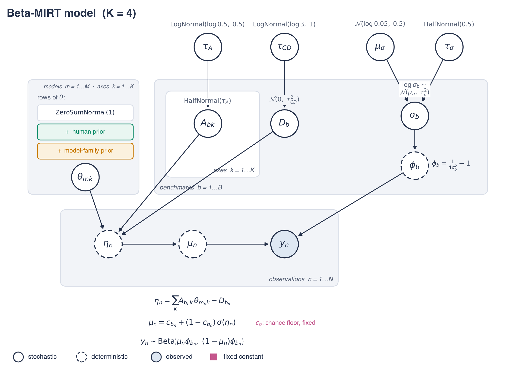
*Figure 10 - La représentation graphique complète du modèle (diagramme en anglais ;
vérifier la page `prior_graph-*` utilisée dans la version anglaise).*

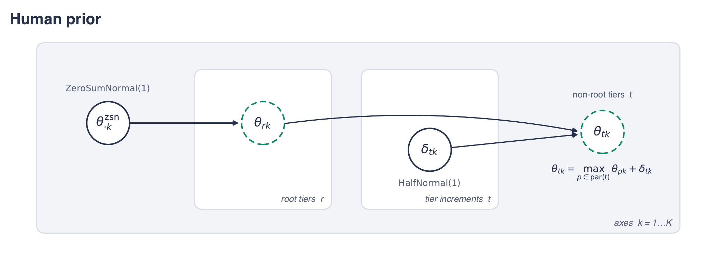
*Figure 11 - La représentation graphique de l'a priori humain (diagramme en
anglais).*

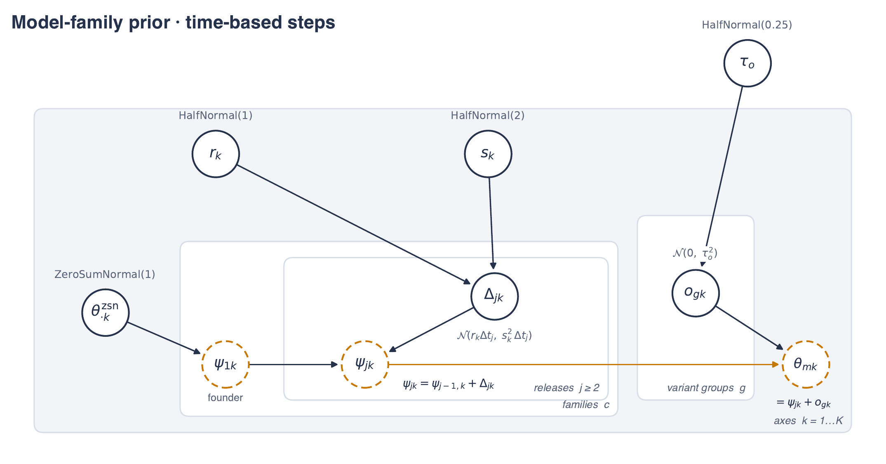
*Figure 12 - La représentation graphique de l'a priori côté modèles (diagramme en
anglais).*

### Annexe B — Les ajustements précédents

Cette annexe consigne les ajustements précédents et l'effet de chaque hypothèse sur
le modèle. Pour le modèle unidimensionnel, nous utilisons tous les benchmarks afin de
le comparer à l'ajustement final. *(Tableau identique à la version anglaise du
billet.)*

### Annexe C — Le mode minoritaire

Quatre des dix exécutions placent les niveaux humains différemment. Cette annexe
consigne ce qui bouge et comment les prévisions changent.

Écart minoritaire moins majoritaire, moyenné sur les neuf niveaux : −2,71 sur
l'Agentique, +1,58 sur les QA historiques, +0,71 sur l'Intelligence fluide, −0,04 sur
les Connaissances et le raisonnement scientifiques. Les deux groupes partagent un
même système d'axes et décrivent les scores aussi bien l'un que l'autre.

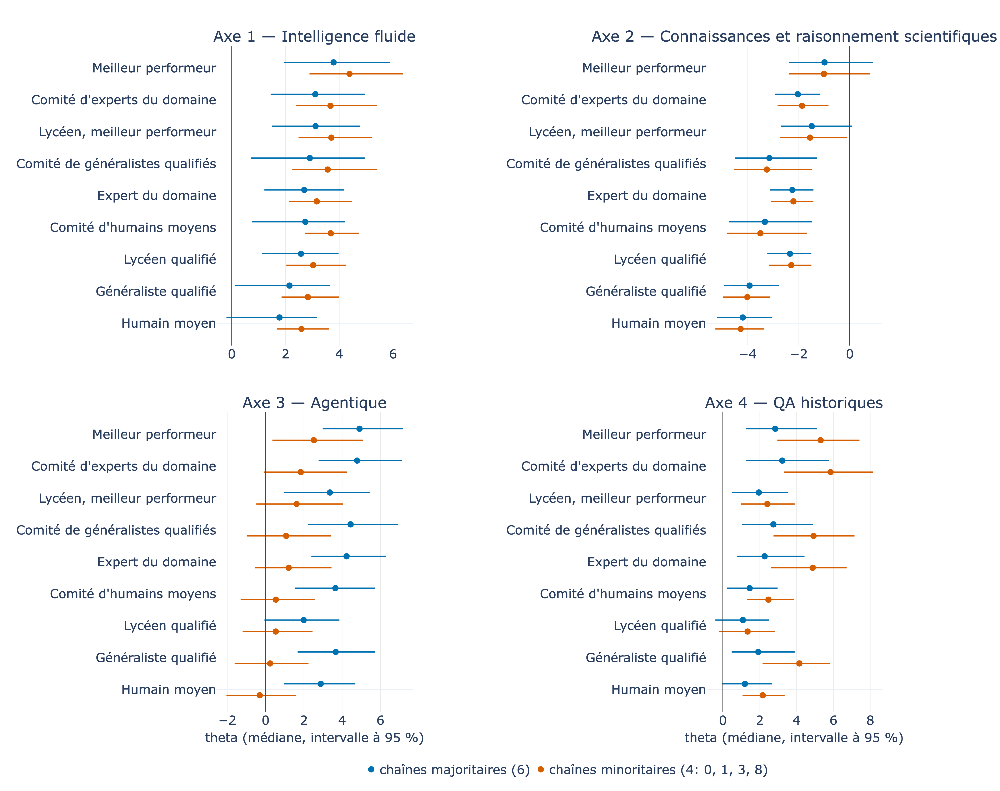
*Figure 13 - Les niveaux humains, les six exécutions majoritaires (bleu) face aux
quatre autres (orange).*

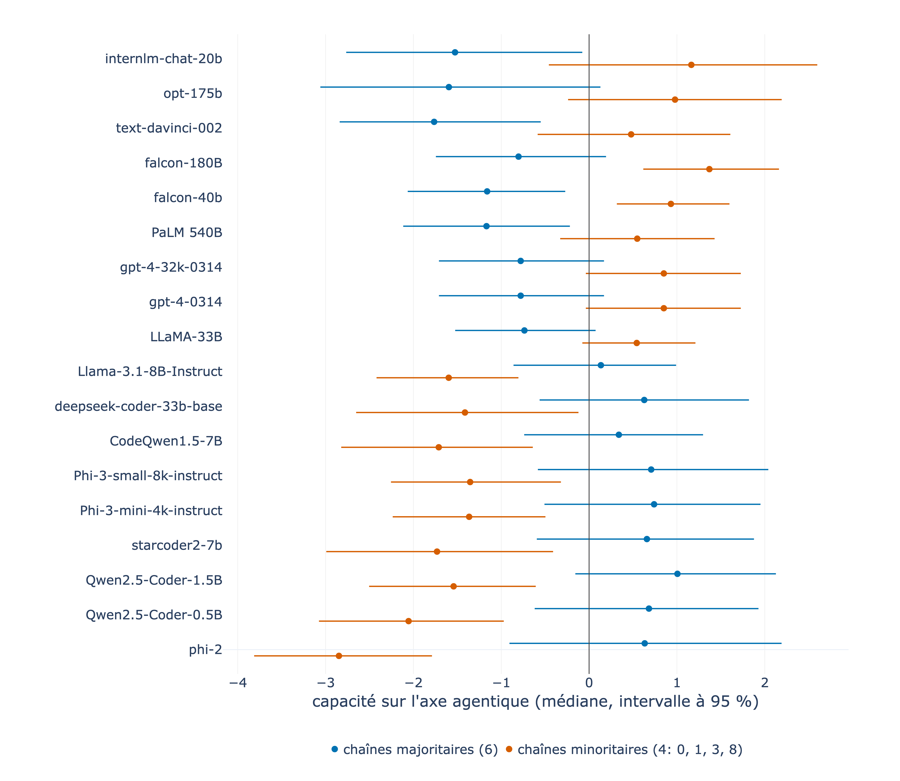
*Figure 14 - Les 18 modèles que les deux groupes d'exécutions placent différemment,
tous sur l'axe Agentique.*

Voici les prévisions pour les chaînes minoritaires :

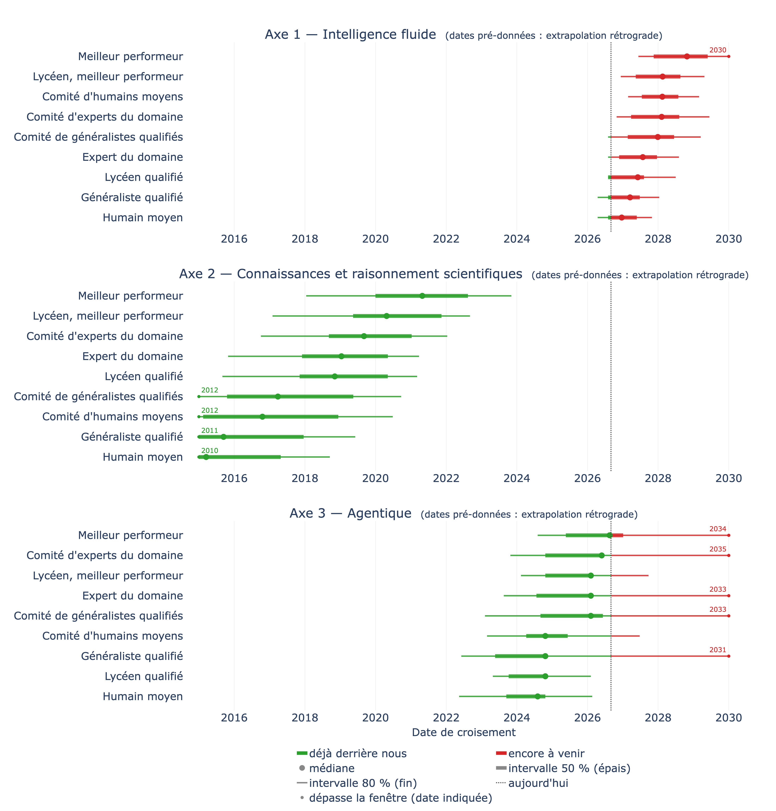
*Figure 15 - Dates auxquelles la tendance extrapolée atteint chaque niveau humain
pour les chaînes minoritaires (médiane, intervalles à 50 % et 80 %). « Aujourd'hui »
correspond au 1er septembre 2026.*

Dans ces prévisions minoritaires, sur l'axe Agentique, tous les niveaux humains
seront bientôt dépassés. Sur l'Intelligence fluide, les modèles de frontière restent
au contraire sous l'Humain moyen, contrairement à ce que prédisent les chaînes
majoritaires.

### Annexe D — Les intervalles à 95 %

Voici les dates de croisement avec les intervalles à 95 %, pour les chaînes
majoritaires et minoritaires :

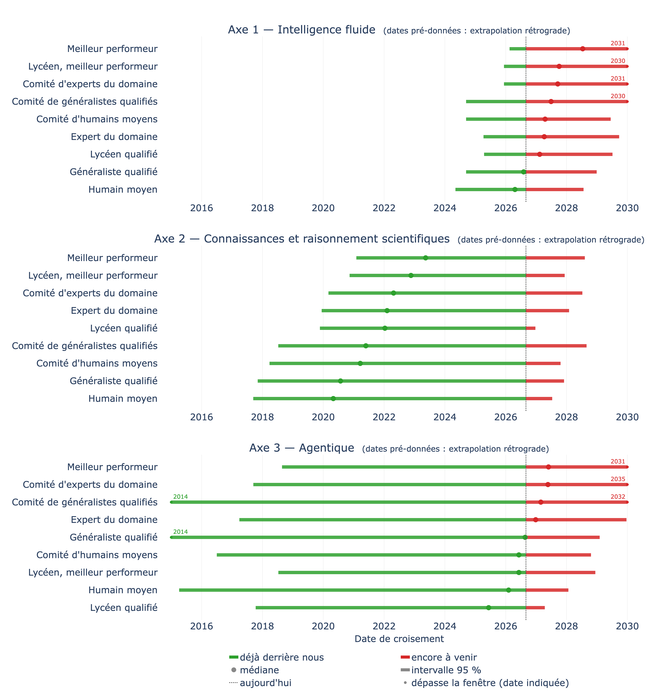
*Figure 16 - Dates auxquelles la tendance extrapolée atteint chaque niveau humain
pour les chaînes majoritaires (médiane, intervalle à 95 %). « Aujourd'hui »
correspond au 1er septembre 2026.*

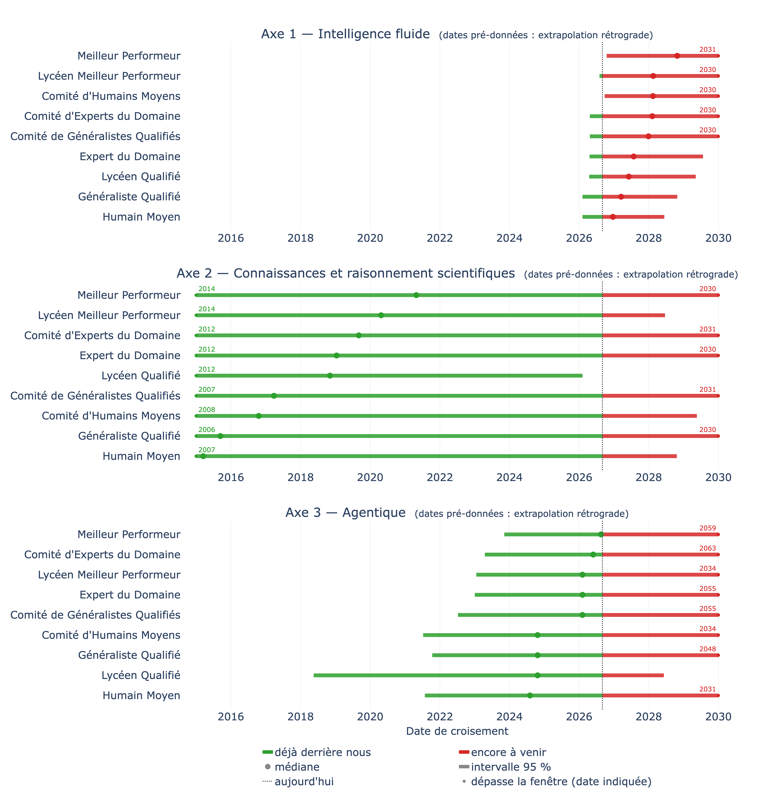
*Figure 17 - Dates auxquelles la tendance extrapolée atteint chaque niveau humain
pour les chaînes minoritaires (médiane, intervalle à 95 %). « Aujourd'hui »
correspond au 1er septembre 2026.*

Chaînes majoritaires : sur tous les axes, les fenêtres à 95 % sont nettement plus
larges, mais se referment au plus tard vers 2035. Chaînes minoritaires : l'axe
Intelligence fluide garde des intervalles à 95 % relativement resserrés ; partout
ailleurs, les incertitudes deviennent très grandes.

### Annexe E — Calibration (PIT)

Pour chaque score observé, nous calculons où il tombe dans la distribution prédictive
du modèle (la transformation intégrale de probabilité, PIT). Un modèle parfaitement
calibré répartirait ces valeurs uniformément ; notre histogramme bombe au centre :
les scores observés tombent près du centre des intervalles prédictifs plus souvent
qu'ils ne le devraient. Les intervalles sont donc plus larges que nécessaire, et le
modèle plutôt conservateur.

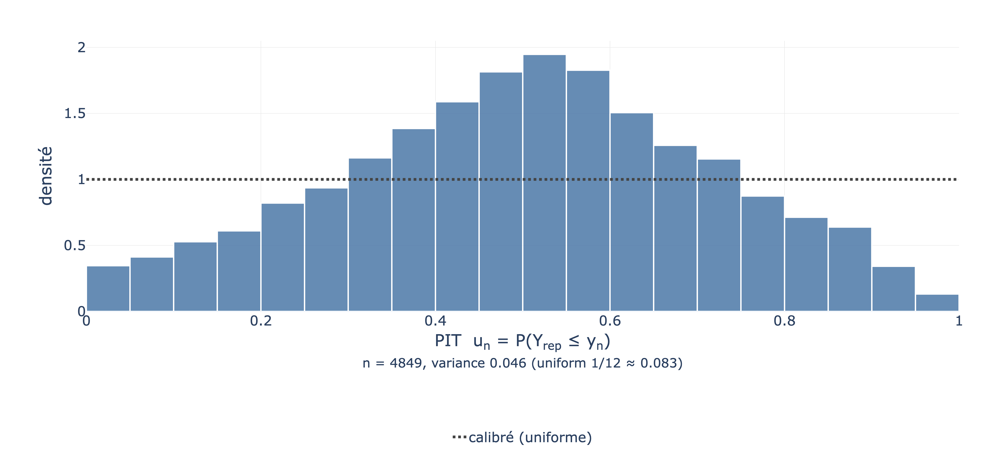
*Figure 18 - PIT de l'ajustement final. Un modèle calibré est plat, à densité 1.*

### Annexe F — Références humaines et liste des benchmarks

Les scores humains utilisés, avec leurs sources, ainsi que la liste exhaustive des
benchmarks inclus dans le modèle, sont donnés dans la version anglaise du billet.
*(Tables identiques ; les huit benchmarks exclus du modèle unidimensionnel y sont
également listés.)*
